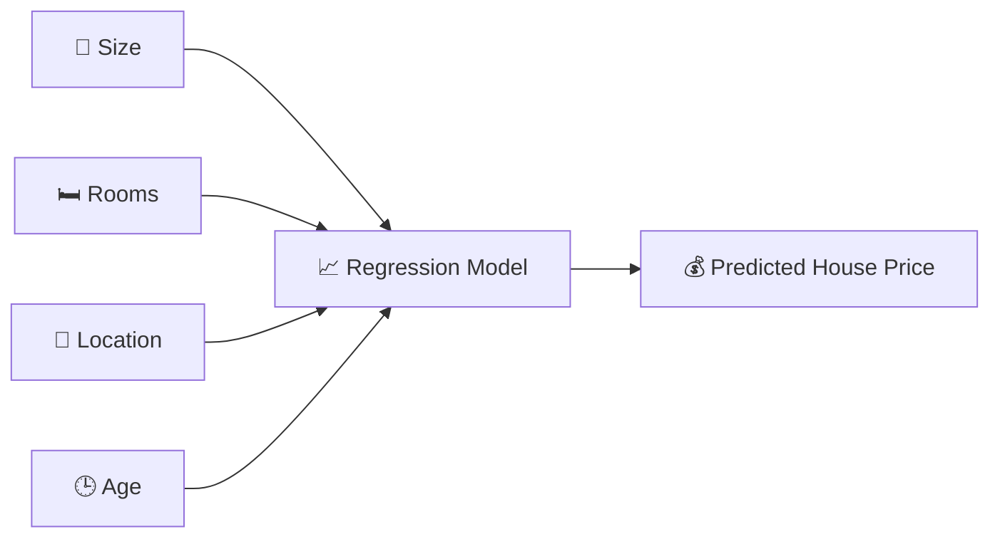
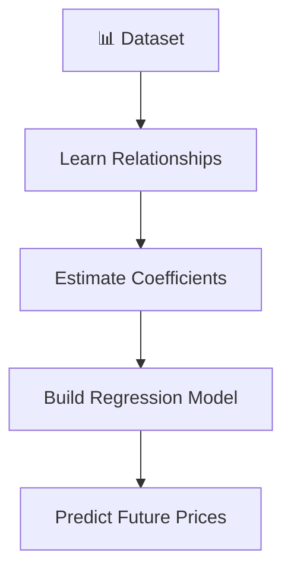
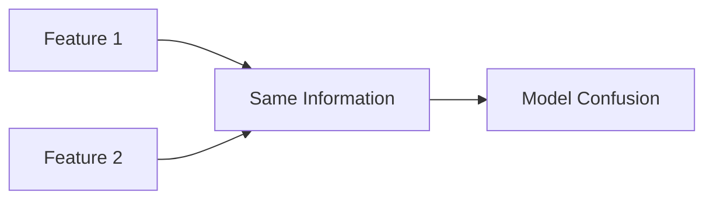
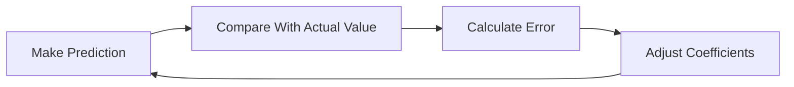
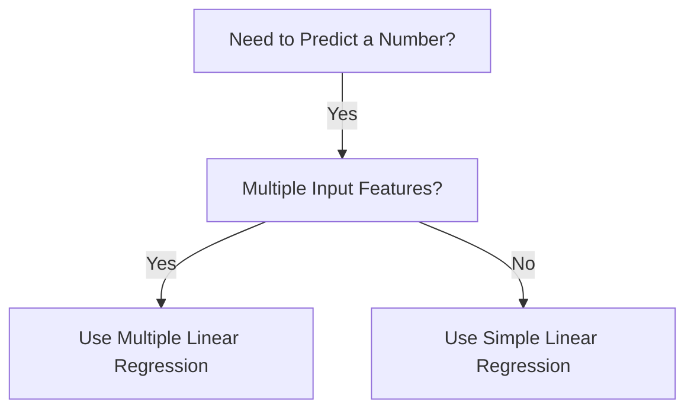

# 🌟 The Story of Multiple Linear Regression in Machine Learning

### 🎬 A Cinematic Beginner’s Guide

---

## 🎭 Meet Our Characters

* 👩 **Riya** – A curious beginner learning Machine Learning.
* 👨‍🏫 **Professor Arjun** – A calm teacher who explains complex ideas simply.
* 🤖 **Milo** – A small robot learning how to predict things using data.

---

# 🌌 Chapter 1: Milo’s First Prediction

One afternoon in the lab…

Riya asked Milo to predict **house prices**.

She gave him only one feature:

* 🏠 Size of the house

Milo quickly learned a pattern.

Bigger house → Higher price.

> 🤖 Milo: “This is easy!”

Professor Arjun smiled.

> 👨‍🏫 “Yes… but the real world is rarely that simple.”

Riya looked confused.

> 👩 Riya: “What do you mean?”

The professor replied:

> 👨‍🏫 “House prices depend on MANY factors, not just one.”

And that’s where **Multiple Linear Regression** begins.

---

# 🧠 Quick Recap: Linear Regression

Before understanding multiple regression, Professor Arjun reminded them of something.

Linear Regression means:

👉 Predicting a number
👉 Using a straight-line relationship

Example:

Predicting **house price using size**.


Only **one feature** is used.

This is called **Simple Linear Regression**.

---

# 🎯 The Real-World Problem

Professor Arjun asked Riya:

> 👨‍🏫 “What else affects house price?”

Riya started listing things:

* 🏠 Size of house
* 🛏 Number of rooms
* 📍 Location
* 🕒 Age of house
* 🚗 Distance from city center
* 🏫 Distance from school

Milo suddenly panicked.

> 🤖 Milo: “That’s too many inputs!”

Professor Arjun smiled again.

> 👨‍🏫 “Don’t worry. There is a model for this.”

---

# 🧠 What is Multiple Linear Regression?

Professor Arjun wrote on the board:

> **Multiple Linear Regression predicts a value using multiple features.**

Instead of one input…

We use **many inputs together**.



So Milo now learns from **multiple factors at once**.

---

# 📐 The Mathematical Idea (Super Simple)

Professor Arjun wrote a formula:

[
y = b_0 + b_1x_1 + b_2x_2 + b_3x_3 + ... + b_nx_n
]

Riya looked scared.

> 👩 Riya: “That looks complicated.”

Professor Arjun simplified it.

| Symbol         | Meaning         |
| -------------- | --------------- |
| **y**          | Prediction      |
| **x₁, x₂, x₃** | Features        |
| **b₀**         | Intercept       |
| **b₁, b₂, b₃** | Feature weights |

Example:

```
House Price =
50000
+ (120 × Size)
+ (10000 × Rooms)
- (200 × Age)
```

Each feature **contributes to the final prediction**.

---

# 🎬 Chapter 2: Teaching Milo the Model

Riya gave Milo a dataset.

Each row contained:

* House size
* Rooms
* Age
* Distance from city
* Actual price

Milo started learning patterns.



Slowly…

Milo began making better predictions.

---

# 📊 Why Multiple Linear Regression is Powerful

Professor Arjun explained.

Real-world problems usually depend on **many variables**.

Examples:

### 💰 Salary Prediction

* Years of experience
* Education level
* Skill rating
* Company size

---

### 🏥 Medical Prediction

* Age
* Weight
* Blood pressure
* Cholesterol

---

### 🏠 House Price Prediction

* Size
* Rooms
* Location
* Age

Multiple inputs → Better predictions.

---

# ⚠ Important Assumptions

Professor Arjun warned Milo:

> 👨‍🏫 “Regression works best when certain conditions are true.”

---

## 1️⃣ Linearity

Relationship between features and target should be roughly linear.

Example:

More experience → Higher salary.

---

## 2️⃣ No Strong Multicollinearity

Features should not strongly depend on each other.

Bad example:

* Height in meters
* Height in centimeters

They give the same information.

---

## 3️⃣ Independent Errors

Prediction errors should not influence each other.

---

## 4️⃣ Homoscedasticity

Error variance should stay roughly constant.

(Simple idea: prediction errors should not explode for large values.)

---

# ⚠ Multicollinearity (Simple Explanation)

Riya asked:

> 👩 Riya: “Why is correlated input bad?”

Professor Arjun explained:

If two features say **the same thing**, the model gets confused.

Example:

* House size in square feet
* House size in square meters



This problem is called **Multicollinearity**.

---

# 🎬 Chapter 3: How Milo Learns the Best Line

But wait…

How does Milo find the **best coefficients**?

Professor Arjun introduced **Least Squares**.

The goal:

👉 Minimize prediction error.



The process repeats until error becomes **very small**.

---

# 📈 Visual Intuition

Imagine a cloud of data points.

The regression model finds the **best-fitting plane** through them.

In simple regression → a line.

In multiple regression → a **multi-dimensional plane**.

---

# 📌 Advantages of Multiple Linear Regression

✔ Easy to understand
✔ Interpretable coefficients
✔ Fast to train
✔ Works well with linear relationships
✔ Good baseline model

---

# ❌ Limitations

✖ Cannot capture complex nonlinear patterns
✖ Sensitive to outliers
✖ Multicollinearity issues
✖ Assumptions must hold

---

# 🧭 When Should Riya Use It?

Professor Arjun drew this decision guide.



Examples:

* House price prediction
* Sales forecasting
* Salary prediction

---

# 🏁 Final Scene: Milo Becomes Smarter

At first Milo used **one feature**.

Now he could use **many features together**.


Milo looked proud.

> 🤖 “Now I understand the world better!”

Professor Arjun nodded.

> 👨‍🏫 “Because real-world problems rarely have only one cause.”

---

# 🎉 Moral of the Story

Simple models look at **one factor**.

Smart models consider **many factors together**.

Multiple Linear Regression helps machines understand **how multiple variables influence outcomes**.

---

# 🧠 What You Learned

✔ What Multiple Linear Regression is
✔ Difference between simple and multiple regression
✔ The regression equation explained
✔ Real-world examples
✔ Model training intuition
✔ Multicollinearity explained
✔ Regression assumptions
✔ Advantages and limitations
✔ When to use the model
