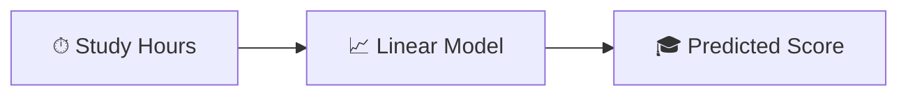
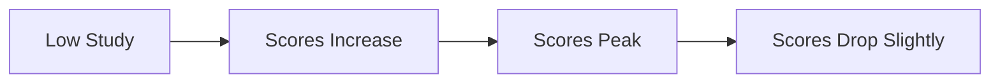
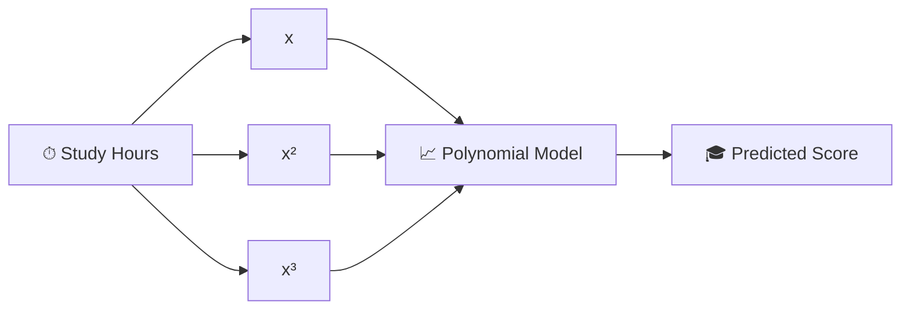
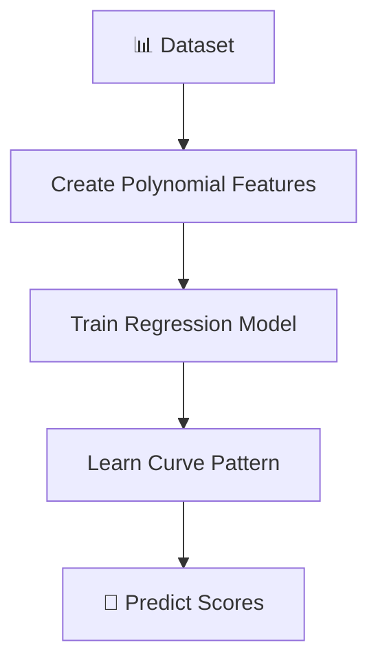
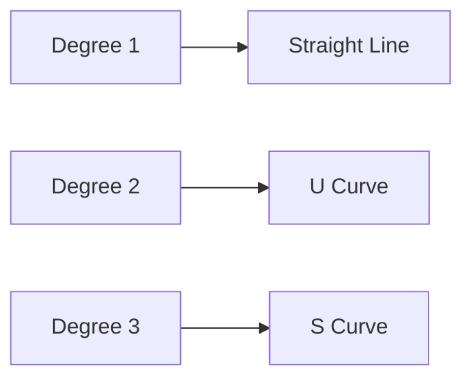
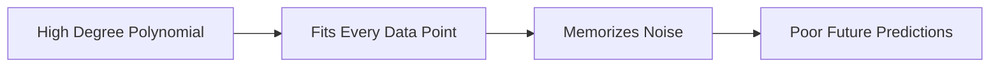
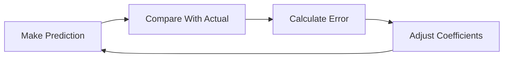
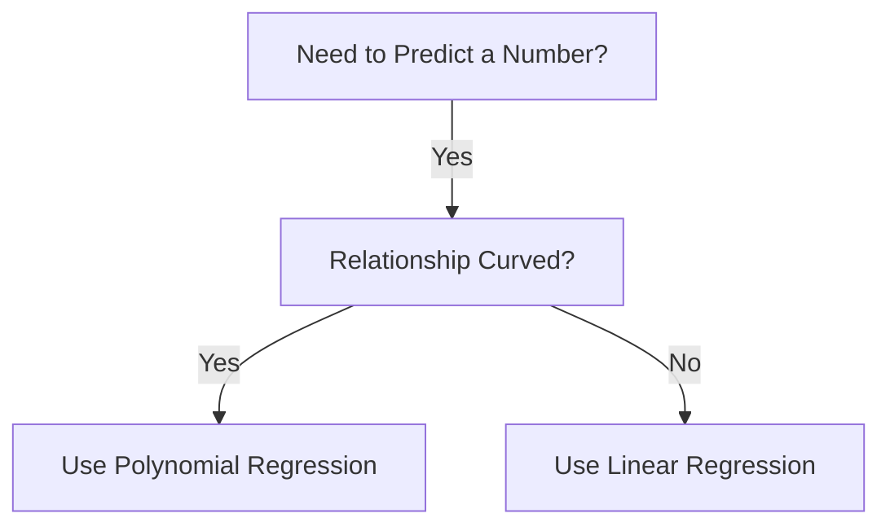
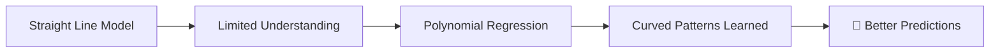

# 🌟 The Story of Polynomial Regression in Machine Learning

### 🎬 A Cinematic Beginner’s Guide

---

# 🎭 Meet Our Characters

* 👩 **Riya** – A curious beginner exploring Machine Learning.
* 👨‍🏫 **Professor Arjun** – A calm teacher who simplifies complex ideas.
* 🤖 **Milo** – A small robot learning how to predict patterns from data.

---

# 🌌 Chapter 1: Milo Gets Confused

One morning in the lab…

Riya asked Milo to predict **student exam scores**.

She gave him one feature:

* ⏱ **Hours of study**

Milo built a **Linear Regression model**.

His rule was simple:

> More study → Higher score.

At first, it worked well.

But then Milo saw something strange.

Students who studied **too much** started getting **tired and stressed**.

Their scores stopped increasing.

Some even **dropped slightly**.

Milo looked confused.

> 🤖 “My straight line doesn’t match the data anymore!”

Professor Arjun smiled.

> 👨‍🏫 “That’s because not every relationship in the world is a straight line.”

Riya leaned closer.

> 👩 “Then what kind of line should we use?”

Professor Arjun replied:

> 👨‍🏫 “Sometimes the world follows a **curve**.”

And that’s where **Polynomial Regression** begins.

---

# 🧠 Quick Recap: Linear Regression

Before introducing something new, Professor Arjun reviewed the basics.

Linear Regression means:

👉 Predicting a number
👉 Using a **straight-line relationship**

Example:

Predict **exam score** using **study hours**.



But linear regression can only draw **straight lines**.

And real-world patterns are not always straight.

---

# 🎯 The Problem With Straight Lines

Riya plotted the data points.

She noticed something interesting.

Scores increased quickly at first…

Then slowed down…

Then slightly decreased.

The pattern looked like a **curve**.



Milo sighed.

> 🤖 “My straight line cannot follow this shape.”

Professor Arjun nodded.

> 👨‍🏫 “Exactly. We need a model that can bend.”

---

# 🧠 What is Polynomial Regression?

Professor Arjun explained.

> **Polynomial Regression is a regression technique that models curved relationships between variables.**

Instead of using just **x**, it also uses **x², x³, and higher powers**.

These extra terms allow the model to create **curves**.



Now Milo could learn **curved patterns** in data.

---

# 📐 The Mathematical Idea (Super Simple)

Professor Arjun wrote an equation.

```
y = b0 + b1x + b2x² + b3x³
```

Riya looked worried.

> 👩 “That looks like a lot of math…”

Professor Arjun simplified it.

| Symbol         | Meaning              |
| -------------- | -------------------- |
| **y**          | Prediction           |
| **x**          | Input feature        |
| **x², x³**     | Curved feature terms |
| **b0**         | Intercept            |
| **b1, b2, b3** | Weights              |

Example:

```
Exam Score =
30
+ (8 × Study Hours)
- (0.5 × Study Hours²)
```

This allows the model to **bend the curve**.

---

# 🎬 Chapter 2: Teaching Milo to Draw Curves

Riya gave Milo a dataset.

Each row contained:

* Study hours
* Actual exam score

Milo began learning.

But this time…

He created **new features**:

* Study hours
* Study hours²
* Study hours³



Slowly…

Milo’s predictions improved.

---

# 📈 Visual Intuition

Professor Arjun explained the idea visually.

In **Linear Regression**:

The model draws a **straight line**.

In **Polynomial Regression**:

The model draws a **curve** that follows the data.

Imagine bending a flexible ruler to match the data points.

---

# 📊 Real-World Examples

Polynomial relationships appear in many places.

---

### 🎓 Learning vs Performance

* Too little study → low scores
* Moderate study → high scores
* Too much study → fatigue

---

### 🚗 Speed vs Fuel Efficiency

* Low speed → inefficient
* Moderate speed → best efficiency
* Very high speed → poor efficiency

---

### 🏃 Exercise vs Health

* Too little exercise → unhealthy
* Moderate exercise → best health
* Too much exercise → injuries

Polynomial regression captures these **curved relationships**.

---

# ⚠ Important Idea: Degree of Polynomial

Riya asked:

> 👩 “What does x² or x³ mean exactly?”

Professor Arjun explained.

The **degree** of a polynomial determines the **shape of the curve**.

Example:

| Degree | Curve Shape    |
| ------ | -------------- |
| 1      | Straight line  |
| 2      | U-shaped curve |
| 3      | S-shaped curve |



Higher degrees create **more flexible curves**.

---

# ⚠ Overfitting (A Common Danger)

But Professor Arjun warned Milo.

> 👨‍🏫 “Too much flexibility can be dangerous.”

If the polynomial degree becomes too high…

The model starts fitting **noise instead of patterns**.



This problem is called **Overfitting**.

---

# 🎬 Chapter 3: How Milo Learns the Curve

Riya asked another question.

> 👩 “How does Milo find the best curve?”

Professor Arjun explained.

The model uses the same idea as linear regression:

👉 **Least Squares**

Goal:

Minimize prediction error.



The model keeps adjusting until the curve **fits the data well**.

---

# 📌 Advantages of Polynomial Regression

✔ Can capture **curved relationships**
✔ Still relatively **simple to implement**
✔ Works well when data follows smooth curves
✔ More flexible than linear regression

---

# ❌ Limitations

✖ Can easily **overfit** with high degree
✖ Sensitive to outliers
✖ Harder to interpret with many powers
✖ Does not scale well to very complex data

---

# 🧭 When Should Riya Use It?

Professor Arjun drew a simple guide.



Examples:

* Growth curves
* Learning curves
* Economic trends
* Physical motion patterns

---

# 🏁 Final Scene: Milo Learns to Bend the Line

At first, Milo could only draw **straight lines**.

But the world was full of **curves**.

Polynomial Regression helped him see those patterns.



Milo smiled proudly.

> 🤖 “Now I can follow curves too!”

Professor Arjun nodded.

> 👨‍🏫 “Because the real world rarely moves in straight lines.”

---

# 🎉 Moral of the Story

Some relationships are **linear**.

But many are **curved**.

Polynomial Regression helps machines understand **curved patterns in data**.

---

# 🧠 What You Learned

✔ What Polynomial Regression is
✔ Why linear regression sometimes fails
✔ How polynomial features work
✔ Polynomial equation explained
✔ Real-world examples
✔ Degree of polynomial concept
✔ Overfitting explained
✔ Advantages and limitations
✔ When to use the model
