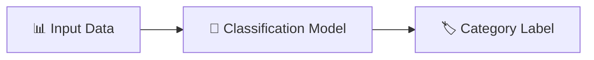
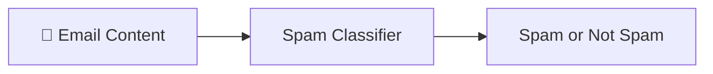
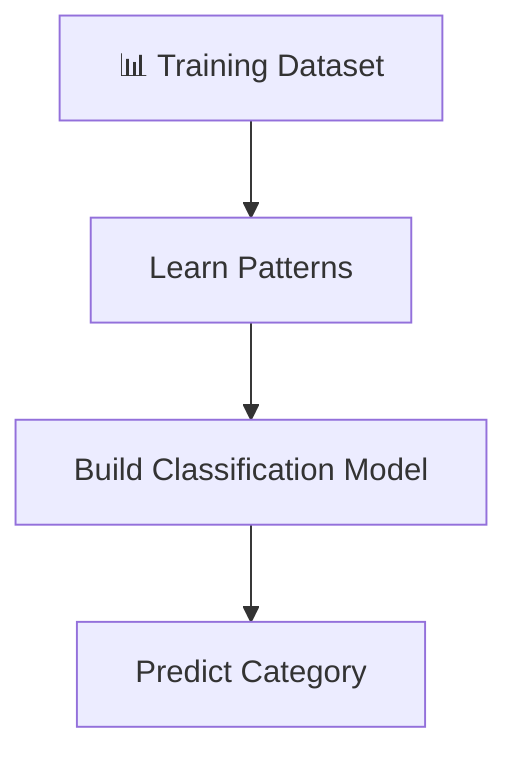
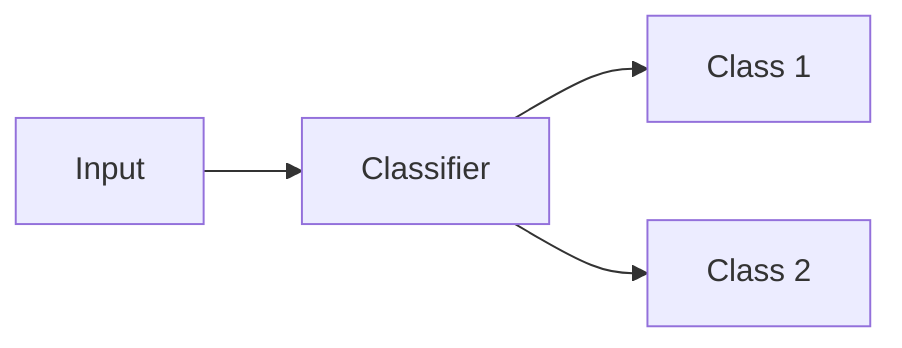
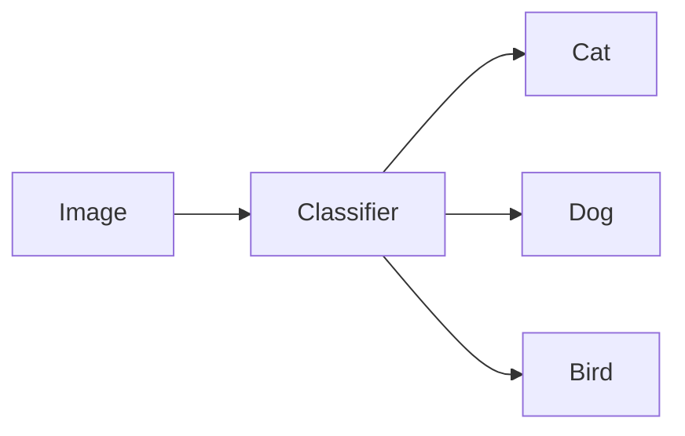
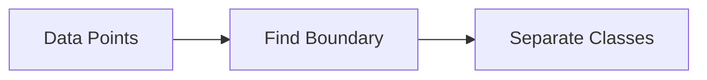
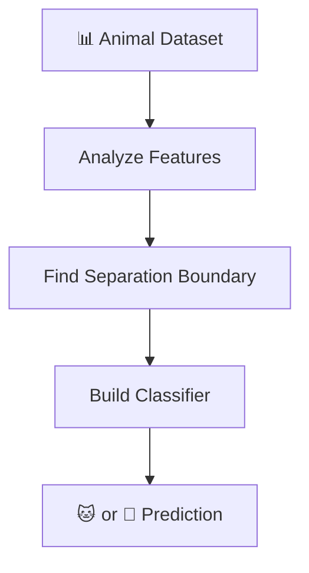
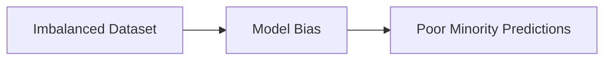
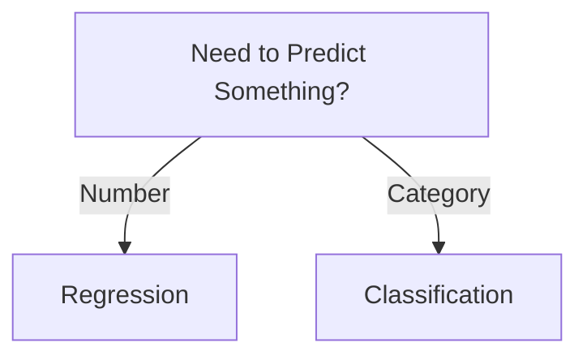
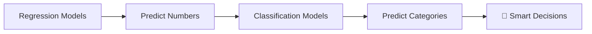

# 🌟 The Story of Classification in Machine Learning

### 🎬 A Cinematic Beginner’s Guide

---

# 🎭 Meet Our Characters

* 👩 **Riya** – A curious beginner learning Machine Learning.
* 👨‍🏫 **Professor Arjun** – A calm teacher who explains complex ideas simply.
* 🤖 **Milo** – A small robot learning how to make decisions from data.

---

# 🌌 Chapter 1: Milo Faces a Different Kind of Problem

One afternoon in the lab…

Riya gave Milo a new task.

But this time it was **different**.

Instead of predicting a number, she asked Milo to **identify emails**.

Each email could be one of two types:

* 📩 **Spam**
* 📬 **Not Spam**

Milo thought for a moment.

> 🤖 “Wait… I cannot predict a number here.”

Professor Arjun nodded.

> 👨‍🏫 “Correct. This problem is not about numbers.”

Riya looked curious.

> 👩 “Then what kind of problem is it?”

Professor Arjun replied:

> 👨‍🏫 “This is called a **Classification Problem**.”

---

# 🧠 What is Classification?

Professor Arjun wrote on the board:

> **Classification is a machine learning task where the goal is to assign data to categories.**

Instead of predicting numbers…

The model predicts **labels or classes**.

Examples:

| Input       | Prediction      |
| ----------- | --------------- |
| Email       | Spam / Not Spam |
| Image       | Cat / Dog       |
| Transaction | Fraud / Legit   |

---

# 🎯 The Goal of Classification

Riya summarized the idea.

> 👩 “So the model just chooses the correct category?”

Professor Arjun smiled.

> 👨‍🏫 “Exactly.”

Example:

Milo realized something important.

> 🤖 “I am not predicting numbers anymore… I am making **decisions**.”

---

# 🎬 Chapter 2: Teaching Milo With Examples

Riya gave Milo a dataset.

Each row contained:

* Email text
* Whether it was **Spam** or **Not Spam**

Milo started learning patterns.

He noticed things like:

* Certain words appear in spam emails
* Some phrases appear in normal emails

Soon Milo could classify **new emails** correctly.

---

# 📊 Types of Classification Problems

Professor Arjun explained that not all classification problems are the same.

There are **three main types**.

---

## 1️⃣ Binary Classification

Only **two possible classes**.

Examples:

* Spam vs Not Spam
* Fraud vs Legit
* Disease vs Healthy

---

## 2️⃣ Multi-Class Classification

More than **two classes**, but only **one correct class**.

Example:

Image recognition.

Possible outputs:

* 🐱 Cat
* 🐶 Dog
* 🐦 Bird

---

## 3️⃣ Multi-Label Classification

Here something interesting happens.

An item can belong to **multiple classes at the same time**.

Example:

Movie genres.

A movie might be:

* 🎬 Action
* 😂 Comedy
* 💖 Romance

All together.

---

# 📈 Visual Intuition

Professor Arjun drew a simple picture.

Imagine a scatter plot of data points.

The classifier tries to **draw boundaries** that separate categories.

These boundaries are called **Decision Boundaries**.

---

# 🎬 Chapter 3: Milo Learns to Draw Boundaries

Riya showed Milo a dataset of animals.

Features included:

* Weight
* Height

And the labels were:

* Cat
* Dog

Milo tried to find a **rule**.

He discovered that certain regions belong to cats…

And other regions belong to dogs.

Now Milo could identify animals **based on their features**.

---

# 📊 Real-World Applications

Classification is everywhere.

---

### 📧 Email Filtering

Classify emails as:

* Spam
* Not spam

---

### 🏥 Medical Diagnosis

Predict if a patient has:

* Disease
* No disease

---

### 💳 Fraud Detection

Bank transactions can be:

* Fraudulent
* Legitimate

---

### 📷 Image Recognition

Identify objects in photos.

Example:

* Cat
* Dog
* Car

---

# ⚠ Important Challenge: Imbalanced Data

Riya noticed something interesting.

In the email dataset:

* 95% emails were **not spam**
* Only 5% were **spam**

Milo became biased.

He started predicting **Not Spam** almost every time.

Professor Arjun explained:

> 👨‍🏫 “This is called **Imbalanced Data**.”

This problem requires special handling.

---

# 📌 Popular Classification Algorithms

Professor Arjun introduced some common classifiers.

Examples include:

* Logistic Regression
* Decision Trees
* K-Nearest Neighbors
* Support Vector Machines
* Neural Networks

All of them solve the **same problem**:

👉 Assign the correct category.

---

# 📈 How Do We Measure Performance?

Riya asked:

> 👩 “How do we know if Milo is doing a good job?”

Professor Arjun explained common metrics.

| Metric    | Meaning                           |
| --------- | --------------------------------- |
| Accuracy  | Percentage of correct predictions |
| Precision | Correct positive predictions      |
| Recall    | Ability to find all positives     |
| F1 Score  | Balance of precision and recall   |

These metrics help evaluate **classification models**.

---

# 📌 Advantages of Classification

✔ Helps machines make **decisions**
✔ Widely used in real-world applications
✔ Works with many types of data
✔ Powerful for pattern recognition

---

# ❌ Limitations

✖ Can struggle with **imbalanced data**
✖ Requires labeled training data
✖ Performance depends on feature quality

---

# 🧭 When Should Riya Use It?

Professor Arjun drew a quick guide.

Examples:

* Spam detection
* Disease diagnosis
* Image recognition
* Fraud detection

---

# 🏁 Final Scene: Milo Learns to Make Decisions

At first, Milo only predicted **numbers**.

But now he could also **categorize things**.

Milo looked proud.

> 🤖 “Now I can not only predict… I can also decide!”

Professor Arjun nodded.

> 👨‍🏫 “Because many real-world problems are about choosing the **right category**.”

---

# 🎉 Moral of the Story

Regression predicts **numbers**.

Classification predicts **categories**.

Classification helps machines **recognize patterns and make decisions**.

---

# 🧠 What You Learned

✔ What classification is
✔ Difference between regression and classification
✔ Binary vs multi-class vs multi-label classification
✔ Decision boundary intuition
✔ Real-world applications
✔ Imbalanced data problem
✔ Evaluation metrics
✔ Advantages and limitations
✔ When to use classification
