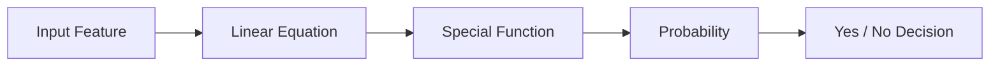
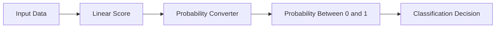

# 🎬 The Story of Logistic Regression

## 🌱 Chapter 1: Why Did Logistic Regression Even Appear?

---

## 🎭 Our Characters Return

* 👩 **Riya** – Still asking questions that confuse everyone.
* 👨‍🏫 **Professor Arjun** – Calm teacher who explains difficult ideas simply.
* 🤖 **Milo** – A robot that recently learned **Linear Regression**.

---

# 🌅 Scene 1: Milo Is Feeling Confident

After many weeks of learning, Milo became very proud.

He had mastered **Linear Regression**.

Now Milo could predict things like:

| Input                 | Prediction        |
| --------------------- | ----------------- |
| House Size            | House Price       |
| Years of Experience   | Salary            |
| Temperature Yesterday | Temperature Today |

Professor Arjun reminded him:

> 👨‍🏫 “Linear Regression is great when we want to **predict numbers**.”

Example:

| Problem             | Output       |
| ------------------- | ------------ |
| Predict house price | ₹45,00,000   |
| Predict sales       | 10,000 units |
| Predict temperature | 31°C         |

All outputs are **numbers**.

Milo was very happy.

> 🤖 “I can predict the future now!”

Riya smiled mischievously.

> 👩 “Let's see if you can solve this problem.”

---

# 🧩 Scene 2: A Different Kind of Problem

Riya showed Milo a new dataset.

| Study Hours | Passed Exam |
| ----------- | ----------- |
| 1           | No          |
| 2           | No          |
| 3           | No          |
| 5           | Yes         |
| 6           | Yes         |
| 8           | Yes         |

Milo stared at it.

Something felt strange.

> 🤖 “Where are the numbers?”

The output was not a number like **50** or **100**.

The answers were just:

```
Yes
No
```

Riya explained:

> 👩 “We want Milo to predict if a student will **Pass or Fail**.”

Milo got excited.

> 🤖 “No problem! I'll use Linear Regression!”

Professor Arjun raised an eyebrow.

> 👨‍🏫 “Let's see what happens…”

---

# 📊 Scene 3: Converting Yes / No Into Numbers

Computers don't understand words like **Yes** or **No**.

So we convert them into numbers.

| Result | Number |
| ------ | ------ |
| No     | 0      |
| Yes    | 1      |

Now the dataset becomes:

| Study Hours | Result |
| ----------- | ------ |
| 1           | 0      |
| 2           | 0      |
| 3           | 0      |
| 5           | 1      |
| 6           | 1      |
| 8           | 1      |

Milo was happy again.

> 🤖 “Great! Now the outputs are numbers!”

---

# 📈 Scene 4: Milo Uses Linear Regression

Milo plots the data.


What Milo sees:

* Some points at **0**
* Some points at **1**

So he draws a **best-fit straight line**.

Just like he learned before.

---

# 🤖 Scene 5: Milo Makes Predictions

Now Milo starts predicting results.

| Study Hours | Linear Regression Prediction |
| ----------- | ---------------------------- |
| 2           | -0.2                         |
| 4           | 0.4                          |
| 6           | 0.9                          |
| 9           | 1.4                          |

Milo proudly shows the results.

But Riya starts laughing.

> 👩 “Milo… something is very wrong.”

---

# ❗ Scene 6: The Big Problem

Professor Arjun asks Milo:

> 👨‍🏫 “What does **-0.2** mean?”

Milo freezes.

Then the professor asks another question.

> 👨‍🏫 “What does **1.4** mean?”

Everyone goes silent.

Because in this problem we are predicting **probability**.

For example:

| Probability | Meaning    |
| ----------- | ---------- |
| 0           | Impossible |
| 0.5         | 50% chance |
| 1           | Guaranteed |

But probability has a **strict rule**:

```
Probability must always be between 0 and 1
```

It **can never be negative**.

It **can never be bigger than 1**.

But Linear Regression is giving predictions like:

```
-0.2
1.4
```

These are **impossible probabilities**.

Milo panics.

> 🤖 “My predictions don't make sense!”

Professor Arjun nods.

> 👨‍🏫 “Exactly.”

---

# 🧠 Why Linear Regression Fails Here

Linear Regression always produces numbers in this range:

```
-∞  to  +∞
```

Meaning:

```
... -10, -5, -2, 0, 3, 8, 20 ...
```

It has **no limits**.

But probabilities must stay in a **safe box**:

```
0 ≤ Probability ≤ 1
```

So we need a model that **forces predictions to stay inside this box**.

---

# 💡 The Birth of Logistic Regression

Scientists realized something important.

Instead of predicting the answer directly, we should:

1️⃣ First compute a **score using a linear equation**

2️⃣ Then **convert that score into probability**

Professor Arjun drew a simple pipeline.



The **special function** squeezes the score into the safe probability range.

---

# 🤯 The Magic Idea

No matter what number the linear equation produces:

```
-100
-5
0
3
50
```

The special function converts it into a value between:

```
0 and 1
```

Example:

| Linear Score | Converted Probability |
| ------------ | --------------------- |
| -5           | 0.01                  |
| -1           | 0.27                  |
| 0            | 0.50                  |
| 2            | 0.88                  |
| 5            | 0.99                  |

Now everything makes sense.

Milo is amazed.

> 🤖 “So we still use a linear equation… but we transform the result!”

Professor Arjun smiles.

> 👨‍🏫 “Exactly. And that idea is called **Logistic Regression**.”

---

# 🎭 What Logistic Regression Really Does



So Logistic Regression is basically:

> **Linear Regression + Probability Conversion**

---

# 🎉 The Core Idea (Very Simple)

Logistic Regression was invented because:

| Problem                                          | Solution                       |
| ------------------------------------------------ | ------------------------------ |
| Linear regression gives impossible probabilities | Add a special function         |
| Probabilities must stay between 0 and 1          | Use a probability curve        |
| We want Yes/No predictions                       | Convert probability into class |

---

# 🎬 Final Scene

Milo finally understands.

> 🤖 “Linear Regression predicts numbers…”

> 🤖 “But Logistic Regression predicts **probabilities of categories**.”

Riya claps.

Professor Arjun nods proudly.

Milo has just discovered **why Logistic Regression was created**.

---

# 🧠 What You Learned

✔ Why Linear Regression cannot solve classification properly
✔ Why probabilities must stay between **0 and 1**
✔ The need for Logistic Regression
✔ The idea of **converting a linear score into probability**

---


