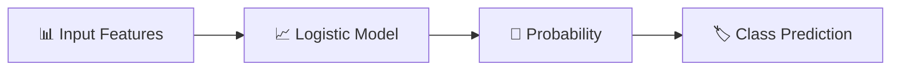
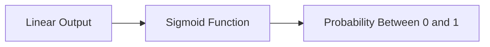
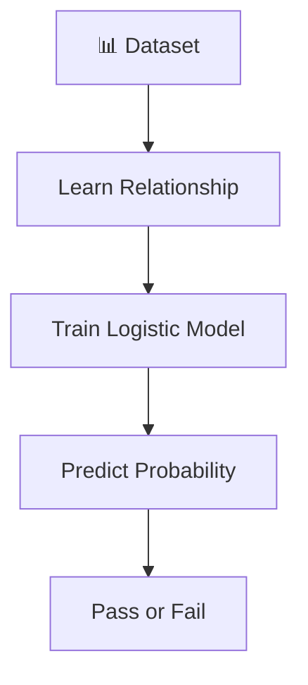
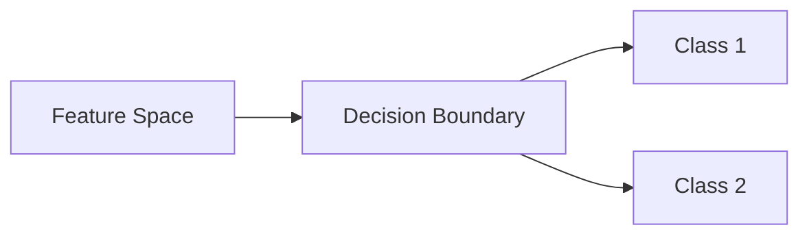
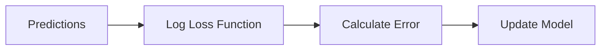
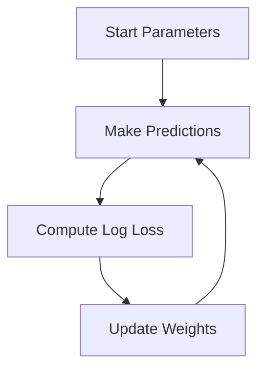
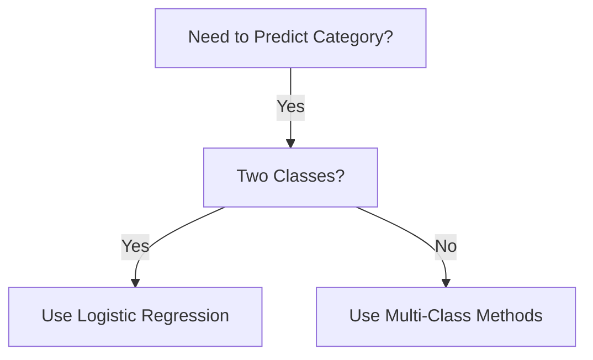
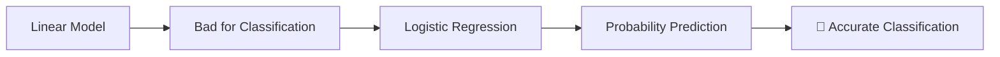

# 🌟 The Story of Logistic Regression in Machine Learning
---

# 🎭 Meet Our Characters

* 👩 **Riya** – A curious beginner learning Machine Learning.
* 👨‍🏫 **Professor Arjun** – A calm teacher who explains difficult ideas simply.
* 🤖 **Milo** – A small robot learning how to make smart predictions from data.

---

# 🌌 Chapter 1: Milo Gets a New Challenge

One afternoon in the lab…

Riya gave Milo a new task.

She showed him a dataset of **students and exam results**.

Each student had:

* ⏱ Hours studied
* 🎓 Exam result

But the result was not a number like 75 or 90.

Instead, it was a **category**:

* ✔ **Pass**
* ❌ **Fail**

Milo tried to solve it using **Linear Regression**.

But something strange happened.

Sometimes Milo predicted:

* 1.3
* -0.2

Riya looked confused.

> 👩 “What does 1.3 mean? A student cannot pass **130%**.”

Professor Arjun smiled.

> 👨‍🏫 “Exactly. Linear regression is not designed for **classification problems**.”

Milo tilted his head.

> 🤖 “Then how do we predict categories?”

Professor Arjun wrote a new name on the board.

> **Logistic Regression**

---

# 🧠 What is Logistic Regression?

Professor Arjun explained.

> **Logistic Regression is a machine learning algorithm used for classification problems.**

Instead of predicting **numbers**, it predicts the **probability of a class**.

Example:

* Probability of passing exam = **0.8**

That means:

> 80% chance the student will **pass**.



---

# 🎯 Example Problem

Riya gave Milo the dataset again.

Features:

* Hours studied

Target:

* Pass or Fail

Milo now predicts something like:

| Study Hours | Predicted Probability |
| ----------- | --------------------- |
| 1 hour      | 0.20                  |
| 3 hours     | 0.45                  |
| 5 hours     | 0.80                  |

Then Milo uses a rule.

If probability ≥ **0.5**

👉 Predict **Pass**

If probability < **0.5**

👉 Predict **Fail**

---

# 🎬 Chapter 2: The Magic S-Shaped Curve

Riya asked an important question.

> 👩 “How does Logistic Regression convert numbers into probabilities?”

Professor Arjun drew a curve.

It looked like an **S shape**.

This curve is called the **Sigmoid Function**.



The sigmoid function squeezes any number into a **range between 0 and 1**.

This makes it perfect for **probabilities**.

---

# 📐 The Mathematical Idea (Super Simple)

Professor Arjun wrote the formula.

```
p = 1 / (1 + e^(-z))
```

Where:

```
z = b0 + b1x
```

Riya looked nervous.

Professor Arjun simplified it.

| Symbol | Meaning               |
| ------ | --------------------- |
| **p**  | Probability of class  |
| **x**  | Input feature         |
| **b0** | Intercept             |
| **b1** | Weight                |
| **e**  | Mathematical constant |

First we compute **z** using a linear equation.

Then the **sigmoid function** converts it into a probability.

---

# 🎬 Chapter 3: Teaching Milo the Model

Riya gave Milo a training dataset.

Each row contained:

* Study hours
* Pass or fail label

Milo started learning patterns.



Gradually Milo became better at predicting results.

---

# 📊 Decision Boundary

Professor Arjun introduced another idea.

> 👨‍🏫 “The model must decide **where the separation happens**.”

Imagine a boundary line.

Students below the line → **Fail**

Students above the line → **Pass**



This line is called the **Decision Boundary**.

---

# 📊 Real-World Applications

Logistic Regression is used everywhere.

---

### 📧 Spam Detection

Classify emails as:

* Spam
* Not Spam

---

### 🏥 Medical Diagnosis

Predict if a patient has:

* Disease
* No disease

---

### 💳 Fraud Detection

Classify transactions as:

* Fraud
* Legitimate

---

### 🛒 Customer Prediction

Predict whether a customer will:

* Buy a product
* Not buy

---

# ⚠ Important Concept: Log-Odds

Riya asked another question.

> 👩 “Why is it called *logistic* regression?”

Professor Arjun explained.

Logistic regression actually models something called **log-odds**.

Formula:

```
log(p / (1 - p)) = b0 + b1x
```

This equation links **probability with the linear model**.

But students usually work with the **sigmoid form**, which is easier.

---

# ⚠ Loss Function in Logistic Regression

Linear regression uses **Mean Squared Error**.

But logistic regression uses a different loss.

It is called **Log Loss** (Binary Cross-Entropy).

Why?

Because squared error does not work well for probabilities.

Goal:

👉 Minimize **Log Loss**.



---

# 🎬 Chapter 4: How Milo Learns (Gradient Descent)

To improve predictions, Milo uses **Gradient Descent**.

Steps:

1️⃣ Make prediction
2️⃣ Calculate log loss
3️⃣ Compute gradients
4️⃣ Update parameters



The process repeats until the error becomes **very small**.

---

# 📌 Advantages of Logistic Regression

✔ Simple and easy to implement
✔ Outputs **probabilities**
✔ Works well for binary classification
✔ Interpretable coefficients
✔ Fast training

---

# ❌ Limitations

✖ Works best with **linear decision boundaries**
✖ Struggles with complex patterns
✖ Sensitive to outliers
✖ Requires good feature engineering

---

# 🧭 When Should Riya Use It?

Professor Arjun drew a quick guide.



Examples:

* Pass vs Fail
* Spam vs Not Spam
* Fraud vs Legitimate

---

# 🏁 Final Scene: Milo Learns to Predict Probabilities

At first Milo tried using **linear regression**.

But that produced impossible predictions.

Logistic Regression solved the problem.



Milo smiled proudly.

> 🤖 “Now I can predict the **chance** of something happening!”

Professor Arjun nodded.

> 👨‍🏫 “Because many real-world decisions are about **probabilities**, not just numbers.”

---

# 🎉 Moral of the Story

Linear regression predicts **numbers**.

Logistic regression predicts **probabilities and categories**.

It helps machines make **smart decisions under uncertainty**.

---

# 🧠 What You Learned

✔ What Logistic Regression is
✔ Why linear regression fails for classification
✔ Sigmoid function explained
✔ Logistic regression equation
✔ Decision boundary intuition
✔ Log-odds concept
✔ Log loss function
✔ Gradient descent training
✔ Real-world applications
✔ Advantages and limitations
