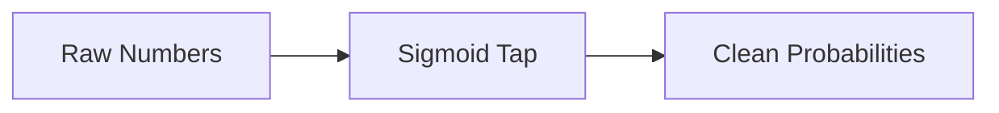
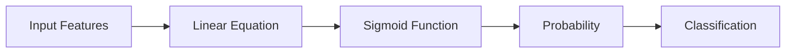

# 🎬 The Story of Logistic Regression

## 🌱 Chapter 3: The Magic Curve That Fixes Milo’s Problem (Sigmoid Function)

---

## 🎭 Our Characters

* 👩 **Riya** – asks the questions everyone is secretly thinking
* 👨‍🏫 **Professor Arjun** – explains difficult things with simple tricks
* 🤖 **Milo** – the robot trying to make **correct probability predictions**

---

# 🌅 Scene 1: Milo’s Problem Returns

Milo was still thinking about the earlier mistake.

When he used **Linear Regression**, he produced predictions like:

| Prediction |
| ---------- |
| -0.2       |
| 0.4        |
| 1.3        |

Riya pointed at the screen.

> 👩 “But probabilities must stay between **0 and 1**.”

Milo sighed.

> 🤖 “Yes… I remember.”

Professor Arjun asked Milo an important question.

> 👨‍🏫 “What if we had a **machine that squeezes any number into the range 0–1**?”

Milo’s eyes lit up.

> 🤖 “Like a **probability converter**?”

Professor Arjun smiled.

> 👨‍🏫 “Exactly.”

And that machine is called the **Sigmoid Function**.

---

# 🧠 The Simple Idea Behind Sigmoid

Think of sigmoid as a **number-squeezing machine**.

It takes **any number in the universe**:

```id="rk1e0q"
-100, -10, -2, 0, 3, 10, 50
```

And converts it into a value between:

```id="i5k0fx"
0 and 1
```

Example:

| Input Number | Output After Sigmoid |
| ------------ | -------------------- |
| -10          | 0.00004              |
| -2           | 0.12                 |
| 0            | 0.50                 |
| 2            | 0.88                 |
| 10           | 0.99995              |

Milo stared at the table.

> 🤖 “Whoa… it really keeps everything between **0 and 1**!”

---

# 📈 The Shape of the Sigmoid Curve

The professor drew the curve on the board.


The curve looks like a **lazy S shape**.

Important observations:

### Left Side

Large negative numbers become:

```id="sc4k7v"
Probability ≈ 0
```

Meaning **almost impossible**.

---

### Middle

When the input is **0**, the probability becomes:

```id="kfbgb2"
0.5
```

Meaning **50% chance**.

Completely uncertain.

---

### Right Side

Large positive numbers become:

```id="1a5b0d"
Probability ≈ 1
```

Meaning **almost guaranteed**.

---

# 🤖 Scene 2: Milo Tries the Machine

Professor Arjun lets Milo test the sigmoid machine.

Milo inputs different numbers.

| Linear Score | Sigmoid Output |
| ------------ | -------------- |
| -5           | 0.006          |
| -2           | 0.12           |
| 0            | 0.50           |
| 1            | 0.73           |
| 4            | 0.98           |

Milo notices something interesting.

> 🤖 “Negative numbers become probabilities close to **0**.”

> 🤖 “Positive numbers become probabilities close to **1**.”

Professor Arjun nods.

---

# 🎯 Why This Is Perfect for Classification

Imagine we are predicting whether a student will **Pass or Fail**.

The sigmoid function might output:

| Study Hours | Sigmoid Output | Meaning               |
| ----------- | -------------- | --------------------- |
| 1           | 0.08           | Very unlikely to pass |
| 3           | 0.30           | Probably fail         |
| 5           | 0.60           | Probably pass         |
| 7           | 0.90           | Almost certain pass   |

Now we just apply a simple rule.

```id="v9x2k7"
If probability ≥ 0.5 → PASS  
If probability < 0.5 → FAIL
```

So the sigmoid output naturally becomes a **decision**.

---

# 🧩 A Simple Way to Imagine Sigmoid

Professor Arjun gave a funny analogy.

Imagine a **water tap**.



Raw numbers are messy:

```id="3otc6o"
-20, -3, 0, 2, 50
```

The sigmoid tap filters them into **safe probabilities**.

```id="o2xnsu"
0.00 to 1.00
```

---

# ⚙️ What Logistic Regression Actually Does

Now the professor connects everything.

Logistic Regression works in **two steps**.



Step 1:

Compute a **linear score**.

Step 2:

Convert that score into **probability using sigmoid**.

Step 3:

Decide the class.

---

# 🧮 The Actual Sigmoid Formula (Don't Panic)

Professor Arjun finally writes the formula.

```id="9ldm1v"
σ(z) = 1 / (1 + e^(-z))
```

Milo looked scared.

> 🤖 “Math!”

Professor Arjun laughed.

> 👨‍🏫 “Relax. For now, just remember the **behavior**, not the formula.”

The important idea is:

* Large negative numbers → output near **0**
* Zero → output **0.5**
* Large positive numbers → output near **1**

---

# 🎭 Final Scene

Milo finally understands.

> 🤖 “So Logistic Regression still uses a linear equation…”

> 🤖 “But then it sends the result through the **Sigmoid Curve**.”

Riya nods.

Professor Arjun summarizes.

> 👨‍🏫 “Sigmoid is the bridge between **linear predictions** and **probabilities**.”

---

# 🎉 Moral of the Story

The **Sigmoid Function** is a mathematical tool that:

* Converts any number into a **probability**
* Keeps outputs between **0 and 1**
* Makes Logistic Regression possible

---

# 🧠 What You Learned

✔ Why we need a probability converter
✔ The intuition behind the sigmoid function
✔ Why the sigmoid curve is S-shaped
✔ How sigmoid transforms numbers into probabilities
✔ How Logistic Regression uses sigmoid

---


