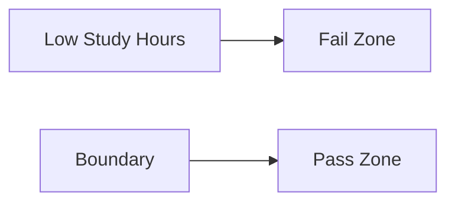

# 🎬 The Story of Logistic Regression

## 🌱 Chapter 4: How the Sigmoid Curve Creates a Decision Boundary

Now Milo already knows:

* Linear Regression gives **unlimited numbers**
* Sigmoid converts them into **probabilities between 0 and 1**

But Milo is still curious.

> 🤖 “Professor… how does this curve actually decide **Pass or Fail**?”

Professor Arjun smiles.

> 👨‍🏫 “Good question. Today we will uncover the **secret behind the decision boundary**.”

---

# 🌅 Scene 1: First Understand What Goes *Into* the Sigmoid

Before sigmoid does anything, something important happens.

The model first computes a number called **z**.

This comes from a **linear equation**.

Example:

```text
z = b0 + b1 × StudyHours
```

Where:

| Symbol     | Meaning                         |
| ---------- | ------------------------------- |
| b0         | Starting value (bias/intercept) |
| b1         | Effect of study hours           |
| StudyHours | Input feature                   |

So Milo first calculates **z**.

Example:

| Study Hours | z value |
| ----------- | ------- |
| 1           | -3      |
| 3           | -1      |
| 5           | 0       |
| 6           | 1       |
| 8           | 3       |

These values can be:

```text
Negative
Zero
Positive
```

And there is **no limit**.

---

# ⚙️ Scene 2: Then Sigmoid Converts z into Probability

Now sigmoid takes **z** and transforms it.

| z  | Sigmoid Output | Probability    |
| -- | -------------- | -------------- |
| -3 | 0.047          | Very unlikely  |
| -1 | 0.27           | Probably no    |
| 0  | 0.50           | Uncertain      |
| 1  | 0.73           | Probably yes   |
| 3  | 0.95           | Almost certain |

Milo notices something interesting.

> 🤖 “Whenever **z increases**, the probability increases too!”

Professor Arjun nods.

Sigmoid is a **smooth increasing function**.

---

# 📈 Visual Intuition of the Curve


Notice three important regions:

### Left Region

Large negative z values.

Probability close to:

```
0
```

Meaning **class 0 (Fail)**.

---

### Middle Region

Around **z = 0**.

Probability becomes:

```
0.5
```

This is the **uncertain zone**.

---

### Right Region

Large positive z values.

Probability close to:

```
1
```

Meaning **class 1 (Pass)**.

---

# 🎯 The Decision Boundary Appears

Now comes the key moment.

We apply a rule:

```
If probability ≥ 0.5 → Class 1
If probability < 0.5 → Class 0
```

But remember something very important.

Sigmoid outputs **0.5 exactly when z = 0**.

So the decision rule becomes:

```
If z ≥ 0 → Class 1
If z < 0 → Class 0
```

Milo’s eyes widen.

> 🤖 “Wait… that means the real boundary happens when **z = 0**!”

Professor Arjun smiles.

Exactly.

---

# 🧠 What Is a Decision Boundary?

A **decision boundary** is simply:

> The point where the model switches from predicting one class to another.

Example:

Student exam prediction.

| Study Hours | Prediction |
| ----------- | ---------- |
| 2           | Fail       |
| 3           | Fail       |
| 4           | Borderline |
| 5           | Pass       |
| 7           | Pass       |

The model draws a **line in the middle**.

That line is the **decision boundary**.

---

# 📊 Visualizing the Decision Boundary

Imagine the horizontal axis is **Study Hours**.



Left side of boundary:

```
Prediction = Fail
```

Right side:

```
Prediction = Pass
```

Sigmoid helps create this **smooth transition**.

---

# 🤖 Scene 3: Why the Curve Is Better Than a Hard Step

Milo asks something clever.

> 🤖 “Why not just use a simple rule like this?”

```
If hours > 4 → Pass
Else → Fail
```

Professor Arjun shakes his head.

That would create a **step function**.

Example:

| Hours | Output |
| ----- | ------ |
| 3.9   | Fail   |
| 4.0   | Pass   |

But real life is **not that sharp**.

Two students studying **4 hours** may have different outcomes.

Sigmoid provides a **smooth probability change**.

Example:

| Hours | Probability |
| ----- | ----------- |
| 3     | 0.20        |
| 4     | 0.45        |
| 5     | 0.70        |
| 6     | 0.90        |

This better reflects **uncertainty**.

---

# 🧩 The Geometry Behind the Boundary

Remember the equation:

```
z = b0 + b1 × x
```

Decision boundary occurs when:

```
z = 0
```

So we solve:

```
b0 + b1 × x = 0
```

Which gives the **boundary location**.

For multiple features:

```
z = b0 + b1x1 + b2x2
```

The boundary becomes a **line** in 2D.

Or a **plane** in higher dimensions.

---

# 📐 Example With Two Features

Imagine predicting admission using:

* Exam score
* Interview score

Decision boundary might look like this.


Points on one side:

```
Rejected
```

Points on the other side:

```
Accepted
```

Sigmoid then converts the **distance from boundary** into probability.

---

# 🤯 A Powerful Intuition

Think of sigmoid like a **confidence meter**.

Close to boundary:

```
0.45
0.55
```

Model is **not sure**.

Far from boundary:

```
0.02
0.98
```

Model is **very confident**.

---

# 🎭 Final Scene

Milo now understands the deeper idea.

> 🤖 “The linear equation creates a boundary…”

> 🤖 “And the sigmoid curve turns distance from that boundary into probability.”

Professor Arjun nods proudly.

This simple idea powers **many classification models**.

---

# 🎉 Moral of the Story

The sigmoid function does two important things:

1️⃣ Converts linear scores into probabilities
2️⃣ Creates a smooth decision boundary between classes

---

# 🧠 What You Learned

✔ What the value **z** means
✔ How sigmoid converts z into probability
✔ Why **z = 0** creates the decision boundary
✔ Why sigmoid produces smooth classification
✔ How distance from boundary affects confidence

---


