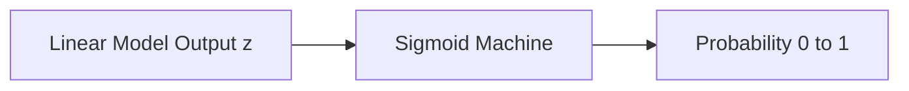
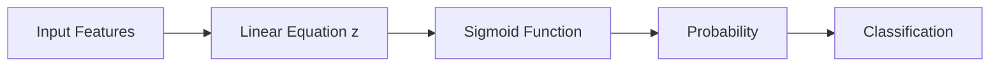

# 🎬 The Story of Logistic Regression

## Chapter: The Mysterious Sigmoid Machine

---

## 🎭 Meet Our Characters Again

* 👩 **Riya** — curious student
* 👨‍🏫 **Professor Arjun** — patient teacher
* 🤖 **Milo** — a tiny robot learning machine learning

---

# 🌅 Scene: Milo’s New Problem

One afternoon in the lab…

Professor Arjun gave Milo a task.

> 👨‍🏫 “Milo, predict whether a student will **pass or fail**.”

Riya looked at the dataset.

| Hours Studied | Result |
| ------------- | ------ |
| 1             | Fail   |
| 2             | Fail   |
| 3             | Fail   |
| 4             | Pass   |
| 5             | Pass   |
| 6             | Pass   |

Milo said confidently:

> 🤖 “Easy! I will use **Linear Regression**!”

He quickly calculated:

```
z = w1x + b
```

Then Milo predicted:

| Hours | Prediction |
| ----- | ---------- |
| 2     | -0.7       |
| 4     | 0.4        |
| 6     | 1.8        |

Riya immediately looked confused.

> 👩 “Wait… what does **-0.7 pass** mean??”

And what does **1.8 pass** mean?

Professor Arjun smiled.

> 👨‍🏫 “Exactly the problem.”

---

# 🤔 The Real Problem

Linear regression outputs:

```
ANY NUMBER
```

Example outputs:

```
-10
-2
0
3
8
100
```

But we want **probability**.

And probability must stay between:

```
0 and 1
```

```
0 = impossible
1 = guaranteed
```

So Milo needs a **number converter**.

---

# 🤖 Professor Arjun Introduces a Machine

The professor walks to the board and draws a machine.



> 👨‍🏫 “This machine is called the **Sigmoid Function**.”

It takes **any number** and converts it into a **probability**.


Example:

| Input z | Output probability |
| ------- | ------------------ |
| -10     | 0.00004            |
| -2      | 0.12               |
| 0       | 0.50               |
| 2       | 0.88               |
| 10      | 0.999              |

So the rule becomes:


Any number in
Probability out

> “Wait… it squeezes EVERYTHING between 0 and 1?”

Yes.

That’s why sigmoid is called a **squashing function**.

---

---

# 📈 What the Sigmoid Curve Looks Like

Professor Arjun draws a strange S-shaped curve.


Riya tilts her head.

> 👩 “Why does it look like a snake?”

Professor Arjun laughs.

> 👨‍🏫 “That snake is the reason logistic regression works.”

---

# 🧠 Understanding the Curve

Let’s see what happens when numbers enter the sigmoid machine.

### When numbers are very negative

Example:

```
z = -10
```

Output becomes:

```
0.00004
```

Meaning:

```
almost impossible
```

---

### When the number is zero

```
z = 0
```

Output becomes:

```
0.5
```

Meaning:

```
50% chance
```

Like flipping a coin.

---

### When numbers are large

Example:

```
z = 10
```

Output becomes:

```
0.999
```

Meaning:

```
almost certain
```

---

# 🤖 Milo Tries the Machine

Milo feeds numbers into the sigmoid machine.

| z  | Probability |
| -- | ----------- |
| -6 | 0.002       |
| -2 | 0.12        |
| 0  | 0.50        |
| 2  | 0.88        |
| 6  | 0.998       |

Milo jumps excitedly.

> 🤖 “It squeezes everything between **0 and 1**!”

Professor Arjun nods.

> 👨‍🏫 “Exactly. That’s why we call it a **squashing function**.”

---
---

# 5️⃣ Why the Curve is S-Shaped

The curve is not straight.

It bends like this:

```
Probability
1 |           ______
  |         /
0.5|-------/
  |      /
0 |_____/
     z
```

Why?

Because the function gradually changes confidence.

Near the middle:

```
small change in z
→ big change in probability
```

Example:

```
z = -0.5 → p = 0.37
z = 0.5  → p = 0.62
```

But at the extremes:

```
z = 10
z = 11
```

Probability barely changes.

Why?

Because it’s already **almost certain**.
---

# 🧮 The Formula Inside the Machine

Riya walks closer to the board.

Professor Arjun writes:

```
σ(z) = 1 / (1 + e^(-z))
```

Riya stares at it.

> 👩 “Professor… that looks scary.”

Professor Arjun laughs.

> 👨‍🏫 “Don’t worry. The formula is just the **engine inside the machine**.”

All it does is:

```
Big negative numbers → close to 0
Zero → 0.5
Big positive numbers → close to 1
```

---

# 📊 The Whole Logistic Regression Pipeline

Professor Arjun now draws the **full pipeline**.



Example:

```
Hours studied = 4
```

Step 1

```
Linear model → z = 1.2
```

Step 2

```
Sigmoid → 0.77
```

Step 3

```
Probability = 77% chance of PASS
```

---

# 🎭 Milo Makes a Prediction

Riya asks Milo:

> 👩 “What if a student studies **3 hours**?”

Milo calculates.

```
z = -0.5
```

Sigmoid converts it:

```
Probability = 0.37
```

Milo announces:

> 🤖 “37% chance of passing!”

Professor Arjun smiles.

> 👨‍🏫 “Now Milo is thinking in **probabilities**.”

And that’s the heart of **Logistic Regression**.

---

# 🎉 Moral of This Chapter

Sigmoid function:

```
takes any number
and converts it into probability
```

That’s what makes **classification possible**.

---

# 🧠 What You Learned

✔ Why linear regression fails for classification
✔ Why probabilities must be between **0 and 1**
✔ What the **sigmoid function** does
✔ Why the sigmoid curve is **S-shaped**
✔ How numbers become probabilities

---

# 🤔 But Something Interesting Happens Next...

Riya suddenly asks:

> 👩 “Professor… when does the model finally say **PASS** or **FAIL**?”

The professor smiles.

> 👨‍🏫 “Ah… that depends on something called the **Decision Boundary**.”

Milo looks curious.

> 🤖 “Decision boundary?”

---

📚 **Next Step in the Journey**

We will discover:

### 🔹 How probability becomes a final decision

### 🔹 Why **0.5** is important

### 🔹 How sigmoid secretly creates a **classification boundary**

And that is where **Logistic Regression truly begins**.
