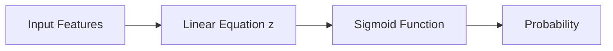
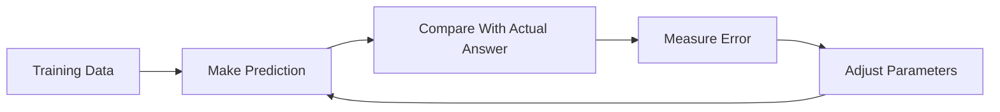
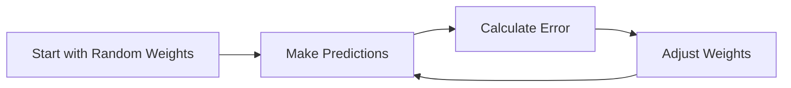
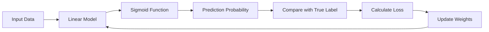

# 🎬 The Story of Logistic Regression

## 🌱 Beginner Classroom Journey

### Step 7: **How Does Logistic Regression Learn?**

---

## 🎭 Meet Our Characters (Back in the Lab)

* 👩 **Riya** — the curious student
* 👨‍🏫 **Professor Arjun** — the patient teacher
* 🤖 **Milo** — our tiny robot trying to learn Machine Learning

---

# 🌅 Scene: Milo Wants to Become Smarter

Milo has learned something amazing.

He now knows how to convert numbers into probabilities using the **sigmoid machine**.

Professor Arjun reminds him of the pipeline:



Riya claps.

> 👩 “Wow Milo! You can predict probabilities now!”

But Professor Arjun raises a finger.

> 👨‍🏫 “Wait… there is a problem.”

Milo freezes.

> 🤖 “Problem??”

---

# 🤔 The Big Question

Professor Arjun writes on the board:

```
z = w₁x₁ + w₂x₂ + b
```

Riya asks:

> 👩 “Where did these numbers come from?”

```
w₁
w₂
b
```

Professor Arjun smiles.

> 👨‍🏫 “Exactly. Milo doesn't know them yet.”

These are called **model parameters**.

They decide:

* how important each feature is
* how predictions change

But right now…

```
Milo is guessing randomly.
```

---

# 🎯 The Real Goal

Professor Arjun explains the real learning process.

Logistic regression must **find the best parameters**.

```
Best w₁
Best w₂
Best b
```

Why?

So predictions match **real data** as closely as possible.

---

# 🧠 How Machines Learn (The Big Idea)

Professor Arjun draws another diagram.



Riya squints.

> 👩 “Wait… it keeps correcting itself?”

Professor Arjun nods.

> 👨‍🏫 “Exactly. Machines learn through **mistakes**.”

---

# 📊 Let’s Watch Milo Learn

Professor Arjun shows Milo a dataset.

| Hours Studied | Actual Result |
| ------------- | ------------- |
| 1             | Fail          |
| 2             | Fail          |
| 4             | Pass          |
| 5             | Pass          |

---

## Milo's First Attempt

Milo guesses some parameters.

```
w = 0.5
b = -1
```

Now he predicts.

| Hours | z    | Probability | Prediction |
| ----- | ---- | ----------- | ---------- |
| 1     | -0.5 | 0.38        | Fail       |
| 2     | 0    | 0.50        | ???        |
| 4     | 1    | 0.73        | Pass       |
| 5     | 1.5  | 0.82        | Pass       |

Riya notices something strange.

> 👩 “The second one is confusing!”

Exactly.

The model is **not perfect yet**.

---

# ⚠ Milo Made a Mistake

Look at this example.

Actual:

```
Fail
```

Prediction:

```
0.50 probability
```

Not confident.

So Milo needs to **adjust parameters**.

---

# 🔁 Learning is an Improvement Loop

Professor Arjun draws a loop on the board.



Riya smiles.

> 👩 “So Milo learns like a student taking practice tests.”

Exactly.

1️⃣ Make a guess
2️⃣ Check mistakes
3️⃣ Improve
4️⃣ Repeat

---

# 🎮 Funny Analogy: Learning Darts

Professor Arjun gives an example.

Imagine Milo playing **darts**.

```
Target = Correct prediction
```

First throw:

```
Misses badly
```

Second throw:

```
Closer
```

Third throw:

```
Even closer
```

Eventually:

```
🎯 Bullseye
```

Machine learning works exactly like this.

---

# 📉 Measuring How Wrong Milo Is

Professor Arjun explains something important.

To improve predictions, Milo must **measure error**.

He writes:

```
How wrong was the prediction?
```

Example:

Actual result:

```
Pass
```

Prediction:

```
0.2
```

That’s very wrong.

But if prediction is:

```
0.9
```

That’s good.

So the model needs a **score that measures mistakes**.

This score is called a **Loss Function**.

---

# 📦 What Logistic Regression Uses

Professor Arjun writes dramatically on the board:

```
Log Loss
```

Riya whispers.

> 👩 “That sounds scary.”

Professor Arjun laughs.

> 👨‍🏫 “It’s just a way to punish bad predictions.”

Example:

| Prediction | Actual | Loss        |
| ---------- | ------ | ----------- |
| 0.9        | Pass   | Small loss  |
| 0.6        | Pass   | Medium loss |
| 0.1        | Pass   | Huge loss   |

So the model tries to:

```
Minimize loss
```

---

# 🧠 The Full Learning Pipeline

Professor Arjun summarizes everything.



Milo suddenly looks proud.

> 🤖 “So I improve by learning from my mistakes!”

Exactly.

That is **machine learning**.

---

# 🎉 Moral of This Chapter

Logistic Regression learns by:

```
1. Making predictions
2. Measuring error
3. Adjusting parameters
4. Repeating many times
```

Eventually it finds:

```
Best weights
```

---

# 🧠 What You Learned

✔ Logistic regression has **parameters (weights)**
✔ The model starts with **random guesses**
✔ Predictions are compared with real answers
✔ The model measures error using **loss**
✔ Parameters are updated to **reduce mistakes**

---

# 🤔 Riya’s New Question

Riya suddenly raises her hand.

> 👩 “Professor… how exactly does Milo **update the weights**?”

Professor Arjun smiles mysteriously.

> 👨‍🏫 “Ah… that requires something powerful.”

He writes on the board:

```
Gradient Descent
```

Milo gasps.

> 🤖 “What is that?!”

---

