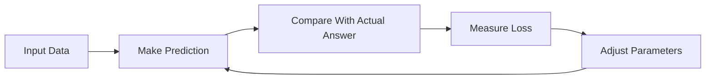
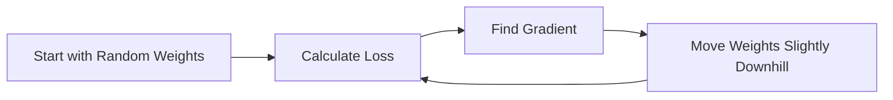
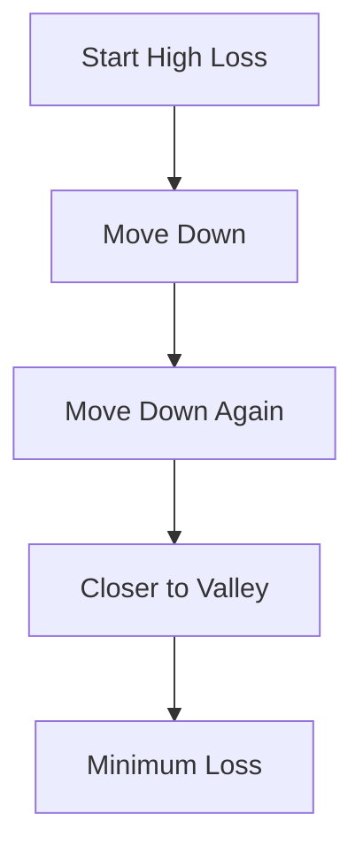

# 🎬 The Story of Logistic Regression

## 🌱 Beginner Classroom Journey

### Step 8: **How Gradient Descent Teaches the Model**

---

## 🎭 Our Learning Crew

* 👩 **Riya** — always asking the right questions
* 👨‍🏫 **Professor Arjun** — the calm explainer
* 🤖 **Milo** — the little robot learning machine learning

---

# 🌅 Scene: The Mystery of Improving Predictions

Last time, Milo learned something important.

Machines improve by **reducing mistakes**.

Professor Arjun had drawn the learning loop:



Riya raises her hand again.

> 👩 “Professor… *how exactly does Milo adjust the parameters?*”

Milo also looks curious.

> 🤖 “Yes! I want to know how to move my weights!”

Professor Arjun smiles.

> 👨‍🏫 “That’s where **Gradient Descent** comes in.”

---

# 🧠 The Big Idea Behind Gradient Descent

Professor Arjun writes on the board:

```
Goal of learning = Minimize Loss
```

Loss means:

```
How wrong the model is.
```

So Milo’s job is simple:

```
Find weights that make loss as small as possible.
```

But how?

---

# 🏔 Imagine a Mountain

Professor Arjun tells a story.

> 👨‍🏫 “Imagine Milo is standing on a **huge foggy mountain**.”

The mountain represents the **loss landscape**.

High points = big errors
Low points = small errors


Riya imagines the scene.

Milo is standing somewhere on the mountain.

But the **best place** is the **bottom of the valley**.

```
Bottom of valley = lowest loss
```

That’s where the **best weights** are.

---

# 🤖 Milo Is Lost in Fog

Milo complains.

> 🤖 “But I can't see the whole mountain!”

Professor Arjun nods.

> 👨‍🏫 “Exactly. Machines never see the full landscape.”

They only know **their current position**.

So Milo must ask a simple question:

```
Which direction goes downhill?
```

---

# 🧭 The Idea of Gradient

The professor draws a slope.

```
     /
    /
   /
  /
```

If Milo stands here, the slope tells him:

```
Downhill is this way.
```

That direction is called the **gradient**.

But since we want to **go down**, we move in the **opposite direction**.

```
Opposite of gradient = Gradient Descent
```

Riya nods.

> 👩 “So Milo follows the downhill direction!”

Exactly.

---

# 🔁 The Learning Steps

Professor Arjun writes the **Gradient Descent loop**.



Milo repeats this process **many times**.

Each step moves him closer to the **lowest loss point**.

---

# 📊 A Simple Example

Let’s say Milo is learning one weight:

```
w
```

First guess:

```
w = 10
```

Loss = **large**

So gradient descent adjusts it.

Next step:

```
w = 8
```

Loss becomes smaller.

Next step:

```
w = 6
```

Loss becomes even smaller.

Eventually:

```
w = 3.2
```

And loss is **minimum**.

---

# 🐾 Step-by-Step Down the Hill

Professor Arjun shows Milo how the steps look.



Riya smiles.

> 👩 “So it’s like walking downhill step by step.”

Exactly.

---

# ⚙ The Update Rule (The Tiny Math Behind It)

Professor Arjun finally reveals the update rule.

```
new weight =
old weight − learning rate × gradient
```

Riya blinks.

> 👩 “Learning rate?”

---

# 🚶 Learning Rate = Step Size

Imagine walking downhill.

You can take:

* tiny steps
* medium steps
* giant jumps

The **learning rate** decides the step size.

```
small learning rate → slow learning
large learning rate → risky jumps
```

---

# 🎯 Example

Suppose:

```
weight = 5
gradient = 2
learning rate = 0.1
```

Update becomes:

```
new weight = 5 − 0.1 × 2
```

```
new weight = 4.8
```

Milo moved **slightly downhill**.

---

# 🤖 Milo Practices Gradient Descent

Milo repeats the process:

1️⃣ predict
2️⃣ compute loss
3️⃣ find gradient
4️⃣ update weights

Over and over.

Eventually Milo says proudly:

> 🤖 “My predictions are much better now!”

Professor Arjun nods.

> 👨‍🏫 “That’s because you reached the **lowest loss**.”

---

# 🎉 Moral of This Chapter

Gradient Descent helps the model:

```
Find the best weights
by walking downhill
toward the lowest loss.
```

---

# 🧠 What You Learned

✔ What **Gradient Descent** is
✔ Why the model wants **minimum loss**
✔ The **mountain/valley intuition**
✔ How weights move step by step
✔ What **learning rate** means

---

# 🤔 But Riya Notices Something Strange

Riya suddenly asks:

> 👩 “Professor… how do we actually **calculate the gradient**?”

Milo freezes.

> 🤖 “Wait… we need calculus for that??”

Professor Arjun smiles.

> 👨‍🏫 “Yes… but don’t worry. We will understand it **visually**.”

---


