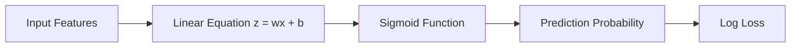

# 🎬 The Story of Logistic Regression

## 🌱 Milo’s Learning Journey Continues

### Step 9: **How Are Gradients Actually Calculated?**

---

## 🎭 Back in the University Lab

* 👩 **Riya** — asking the questions everyone is thinking
* 👨‍🏫 **Professor Arjun** — the calm guide
* 🤖 **Milo** — our robot trying to master Machine Learning

---

# 🌅 Scene: Milo Learns to Walk Down the Mountain

Last time, Professor Arjun explained **Gradient Descent**.

Milo imagined himself on a foggy mountain trying to reach the lowest valley.

The rule was simple:

```text
Move downhill step by step
```

But Milo suddenly stopped walking.

> 🤖 “Wait… how do I know which direction is downhill?”

Riya nods.

> 👩 “Yes! How do we calculate the **gradient**?”

Professor Arjun smiles.

> 👨‍🏫 “To understand gradients… we must first understand something called **slope**.”

---

# 📏 Step 1 — Understanding Slope (The Foundation)

Imagine a simple hill.

```
      /\
     /  \
    /    \
```

If you stand on the hill and look around, you can ask:

```
How steep is the hill here?
```

That steepness is called the **slope**.

---

## Example

Suppose a line looks like this:

```
y = 2x
```

Graphically it looks like:

```
y
|
|      /
|     /
|    /
|___/________ x
```

For every step you move in **x**, the height changes.

Example:

| x | y |
| - | - |
| 1 | 2 |
| 2 | 4 |
| 3 | 6 |

So the slope is:

```
2
```

Meaning:

```
y increases 2 units
for every 1 unit of x
```

---

# 🧠 Step 2 — What Is a Derivative?

Now Professor Arjun introduces a new word.

```text
Derivative
```

But don’t panic — it’s just a fancy name.

Derivative simply means:

```text
How fast something changes
```

Or even simpler:

```text
Instant slope
```

Riya summarizes:

> 👩 “So derivative = slope?”

Professor Arjun nods.

> 👨‍🏫 “Exactly.”

---

# 📉 Step 3 — Slope on Curved Surfaces

Things get interesting when the curve is not straight.

Look at this curve.

```
     *
   *   *
  *     *
 *       *
*         *
```

Here the slope changes depending on where you stand.

Example:

Left side:

```
Slope = steep upward
```

Middle:

```
Slope ≈ flat
```

Right side:

```
Slope = downward
```

This changing slope is exactly what **derivatives measure**.

---

# 🏔 Step 4 — Applying This to Machine Learning

Now imagine the **loss function landscape**.


The horizontal axis represents:

```
Model parameters (weights)
```

The vertical axis represents:

```
Loss (error)
```

If Milo stands somewhere on this curve, the derivative tells him:

```
Which direction increases loss
```

So to reduce loss, Milo moves in the **opposite direction**.

That’s why we call it:

```
Gradient Descent
```

---

# 🤖 Step 5 — The Gradient in Logistic Regression

Now we connect everything.

Logistic Regression has this pipeline:



The gradient is calculated from the **loss function**.

So we ask:

```
How does loss change when weight changes?
```

That answer is the **gradient**.

---

# 📊 Step 6 — A Tiny Example

Imagine a very simple dataset.

| Hours Studied | Actual Result |
| ------------- | ------------- |
| 1             | Fail (0)      |
| 5             | Pass (1)      |

Suppose Milo predicts:

```
P(pass) = 0.3
```

But the real answer is:

```
1
```

So the model made an error.

Now the gradient asks:

```
If we increase the weight slightly,
will the loss increase or decrease?
```

If increasing the weight **reduces loss**, then we should increase it.

If it **increases loss**, then we decrease it.

This direction is given by the gradient.

---

# ⚙ Step 7 — The Real Gradient Formula

Inside logistic regression, something beautiful happens.

The gradient becomes:

```
gradient = prediction − actual
```

Meaning:

| Prediction | Actual | Gradient |
| ---------- | ------ | -------- |
| 0.8        | 1      | -0.2     |
| 0.2        | 1      | -0.8     |
| 0.9        | 0      | 0.9      |

So the model adjusts weights based on:

```
Prediction error
```

Simple and elegant.

---

# 🔁 Step 8 — Weight Update

Finally Milo updates the weights.

The rule is:

```
new weight =
old weight − learning_rate × gradient × feature
```

Example:

```
weight = 2
gradient = -0.4
learning_rate = 0.1
feature = 5
```

Update becomes:

```
new weight = 2 − (0.1 × -0.4 × 5)
```

```
new weight = 2 + 0.2
```

```
new weight = 2.2
```

So the model **moves toward better predictions**.

---

# 🤖 Milo Finally Understands

Milo jumps excitedly.

> 🤖 “The gradient tells me how to change my weights!”

Professor Arjun nods.

> 👨‍🏫 “Exactly.”

The gradient answers the most important question in machine learning:

```
Which direction should we move to reduce error?
```

---

# 🎉 Moral of This Chapter

Gradient calculation tells the model:

```
How sensitive loss is to parameter changes.
```

Then gradient descent uses that information to:

```
Adjust weights step by step
until loss becomes minimal.
```

---

# 🧠 What You Learned

✔ What **slope** means
✔ What **derivatives** measure
✔ How derivatives relate to gradients
✔ How gradients guide optimization
✔ How logistic regression updates weights

---

# 🤔 Riya’s Next Question

Riya looks at the sigmoid curve again.

> 👩 “Professor… the sigmoid function is curved.”

> “Does that mean the **decision boundary is curved too?**”

Milo looks shocked.

> 🤖 “Wait… is logistic regression actually **non-linear**?!”

Professor Arjun smiles.

> 👨‍🏫 “That’s a fascinating question.”

---

