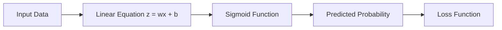

# 🎬 The Story of Logistic Regression

## Step 7: Cost Function / Loss Function

### 🌱 Continuing Our Classroom Story

Our characters are back.

* 👨‍🏫 **Professor Arjun** – the patient teacher
* 👩 **Riya** – the curious student
* 🤖 **Milo** – the tiny robot learning machine learning

So far Milo has learned something amazing.

```
Input Data → Linear Equation → Sigmoid → Probability
```

Example:

```
Student studied 5 hours
↓
Model prediction
↓
Probability of passing exam = 0.82
```

Milo proudly says:

> 🤖 "I predict **82% chance the student will pass**!"

Riya claps.

But then she pauses.

She squints at Milo suspiciously.

---

# 🤔 Riya's Big Question

> 👩 **Riya:**
> "Okay Milo… you are making predictions."

She points at the board.

> "But how do we know if your predictions are **good or terrible**?"

The classroom becomes silent.

Even Milo freezes.

```
🤖 processing...
```

Professor Arjun smiles.

He writes a new concept on the board.

# 🎯 Loss Function

---

# 🧠 What Is a Loss Function?

Professor Arjun explains:

> **A Loss Function measures how wrong the model is.**

Think of it like a **teacher grading an exam**.

| Prediction | Actual Result | Good or Bad? |
| ---------- | ------------- | ------------ |
| 0.95       | 1             | Very good    |
| 0.70       | 1             | Okay         |
| 0.20       | 1             | Bad          |

But the model needs a **number** to understand the mistake.

So the loss function converts prediction errors into a **penalty score**.

```
Small Loss → Model is doing well
Big Loss → Model is making mistakes
```

---

# 🎯 Simple Analogy: Weather Prediction 🌧

Professor Arjun gives a fun example.

Suppose Milo predicts:

```
Probability of rain tomorrow = 0.9
```

Next day:

```
It actually rains.
```

Riya nods.

> 👩 "That was a **good prediction**."

So the **loss should be small**.

But imagine Milo predicts:

```
Probability of rain = 0.02
```

And suddenly…

```
⛈ STORM ⛈
```

Now Milo was **very wrong**.

So the **loss should be BIG**.

---

# 📊 Why Logistic Regression Needs a Special Loss

Riya remembers something.

> 👩 "Wait… in Linear Regression we used **Mean Squared Error (MSE)**."

She asks:

> "Why can't we use that again?"

Professor Arjun draws two curves.


He explains slowly.

For **classification problems**, MSE causes problems:

• Learning becomes **slow**
• The optimization surface becomes messy
• The model struggles to converge

So machine learning researchers designed a **better loss function** for classification.

---

# 🧠 The Special Loss: Log Loss

This loss is called:

### **Log Loss (Binary Cross Entropy)**

Professor Arjun writes the formula.

[
Loss = -[y \log(p) + (1-y)\log(1-p)]
]

Riya looks shocked.

> 👩 "Professor… that looks scary."

Professor Arjun laughs.

> 👨‍🏫 "It only looks scary.
> The idea is actually very simple."

Let's decode it slowly.

---

# 🔎 First Understand the Symbols

| Symbol | Meaning                |
| ------ | ---------------------- |
| **y**  | Actual answer (0 or 1) |
| **p**  | Predicted probability  |

Example:

```
p = 0.8
```

means

```
80% chance of class = 1
```

---

# 📘 Case 1: Actual Answer = 1

Suppose the correct answer is:

```
y = 1
```

Then the formula becomes:

[
Loss = -\log(p)
]

Let's see what happens.

| Prediction p | Loss       |
| ------------ | ---------- |
| 0.99         | Very small |
| 0.9          | Small      |
| 0.5          | Medium     |
| 0.1          | Very big   |

Professor Arjun explains:

```
Correct prediction → small penalty
Wrong prediction → big penalty
```

---

# 📘 Case 2: Actual Answer = 0

Now suppose:

```
y = 0
```

The formula becomes:

[
Loss = -\log(1-p)
]

| Prediction p | Loss       |
| ------------ | ---------- |
| 0.01         | Very small |
| 0.2          | Small      |
| 0.7          | Big        |
| 0.95         | Huge       |

Again the pattern appears.

```
Correct predictions → small loss
Wrong predictions → big loss
```

---

# 📉 Why Logarithm Is Used

Professor Arjun draws a curve.


He explains something important.

Logarithms create **very large penalties for confident wrong predictions**.

Example:

```
Prediction = 0.01
Actual = 1
```

Loss becomes **huge**.

This forces the model to **fix big mistakes quickly**.

---

# 🤖 Milo Understands the Pipeline

Milo redraws the learning process.



Now Milo can do something new.

He can measure:

```
How wrong am I?
```

---

# 🎭 Riya's Next Question

Riya thinks for a moment.

> 👩 "Okay… now Milo can measure mistakes."

But she asks the most important question yet.

> **"How does Milo actually FIX those mistakes?"**

Professor Arjun smiles again.

> 👨‍🏫 "Excellent question."

He writes the next topic on the board.

---


