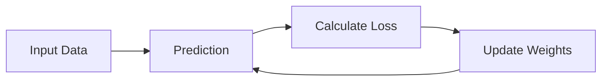

# 🎬 The Story of Logistic Regression

## Step 8: Gradient Descent — How Milo Improves His Predictions

---

## 🎭 Back in the Machine Learning Lab

Our classroom friends return.

* 👨‍🏫 **Professor Arjun** – calm and wise
* 👩 **Riya** – always asking sharp questions
* 🤖 **Milo** – the little robot learning machine learning

Last time Milo learned something important:

```
Prediction → Compare with Reality → Calculate Loss
```

Example:

| Prediction | Actual | Loss   |
| ---------- | ------ | ------ |
| 0.90       | 1      | small  |
| 0.60       | 1      | medium |
| 0.10       | 1      | huge   |

Milo now knows **how wrong he is**.

But Riya raises her hand again.

---

# 🤔 Riya's Big Question

> 👩 **Riya:**
> “Okay Milo… you can measure mistakes.”

She taps the board.

> “But how do you **fix them**?”

Milo freezes again.

```
🤖 ERROR
HOW DO I IMPROVE?
```

Professor Arjun smiles and writes two magical words.

# 🧭 Gradient Descent

---

# 🧠 Big Intuition First

Professor Arjun explains slowly.

> Gradient Descent is the **method the model uses to improve itself**.

Think of it like this:

```
Make prediction
↓
Check error
↓
Adjust weights
↓
Repeat again
```

Over time, the model becomes **better and better**.

---

# ⛰ The Mountain Analogy

Professor Arjun turns the lights off and projects an image.


He explains.

Imagine you are **standing on a mountain at night**.

You want to reach the **lowest point of the valley**.

But it is completely dark.

You cannot see the whole terrain.

So what do you do?

You take **small steps downhill**.

Step by step.

Until you reach the **lowest point**.

---

# 🧠 What the Valley Represents

Professor Arjun labels the diagram.

| Concept          | Meaning         |
| ---------------- | --------------- |
| Mountain         | Large error     |
| Valley bottom    | Minimum error   |
| Walking downhill | Improving model |

So the goal is:

```
Find the lowest loss possible
```

---

# 🤖 Milo's Job

Milo now understands his mission.

```
Find weights that give the smallest loss
```

Example model:

```
z = wx + b
```

Two parameters:

```
w → weight
b → bias
```

These numbers control **how predictions are made**.

But at the start they are **random guesses**.

Example:

```
w = 0.3
b = 0.7
```

Bad guesses → bad predictions.

So Milo must **adjust them slowly**.

---

# 🔁 The Learning Loop

Professor Arjun draws the learning cycle.



This loop repeats **thousands of times**.

Every iteration:

```
prediction improves slightly
```

---

# 🪜 Small Steps Only

Riya asks another question.

> 👩 “Why small steps? Why not jump directly to the best answer?”

Professor Arjun laughs.

Because big jumps are dangerous.

Imagine this:

```
You jump too far
```

You might overshoot the valley and go uphill again.

So gradient descent uses **tiny careful steps**.

---

# 🎯 The Learning Rate

The step size is controlled by something called:

```
Learning Rate
```

Example:

```
learning_rate = 0.01
```

Meaning:

```
Move only 1% of the step direction
```

Too large:

```
Model jumps wildly
```

Too small:

```
Model learns very slowly
```

---

# 📊 Visualizing Gradient Descent

Professor Arjun shows another picture.


You can see the model moving step-by-step toward the **lowest loss**.

Each step adjusts the weights.

---

# 🤖 Milo's Learning Strategy

Milo summarizes his new skill.

```
1. Make prediction
2. Measure loss
3. Move weights slightly
4. Repeat many times
```

After thousands of updates:

```
Predictions become accurate
```

---

# 🎭 Riya Is Curious Again

Riya folds her arms.

> 👩 “Wait a minute…”

> “How does Milo know **which direction is downhill**?”

The classroom becomes quiet.

Even Milo tilts his head.

```
🤖 How do I know which way to move?
```

Professor Arjun smiles.

He writes the next powerful idea.

---


