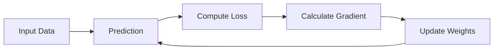

# 🎬 The Story of Logistic Regression

## Step 9: Gradients — How the Model Knows Which Way to Move

---

## 🎭 Scene: The Dark Mountain Problem

Back in the university lab…

Milo the robot is trying to **reduce his mistakes**.

He already knows the process:

```
Prediction → Calculate Loss → Improve Model
```

But he still has a problem.

Riya notices Milo staring at the board.

> 👩 **Riya:**
> "What's wrong, Milo?"

Milo looks worried.

> 🤖 **Milo:**
> "I understand I must go **downhill to reduce loss**…"

> "But how do I know **which direction is downhill**?"

The room becomes quiet.

Professor Arjun smiles.

He writes one powerful word on the board.

# 🧠 Gradient

---

# 🌄 First Intuition: Standing on a Hill

Professor Arjun draws a picture.


He explains.

Imagine you are standing on a hill.

You want to go **down to the lowest point**.

But it is **dark**.

You cannot see the valley.

So what do you do?

You feel the **slope under your feet**.

If the ground tilts **left**, you go left.

If the ground tilts **right**, you go right.

That tilt is called:

```
The Gradient
```

---

# 📉 What Is a Gradient?

Professor Arjun writes a simple definition.

> **Gradient = The direction of the steepest increase of a function.**

But Ravi looks confused.

> 👩 **Riya:**
> "Increase? But we want to go DOWN!"

Excellent observation.

Professor Arjun smiles.

```
Gradient points UPHILL
```

So to go downhill we move in the **opposite direction**.

```
Downhill direction = -Gradient
```

---

# 📊 Visualizing the Gradient

Professor Arjun sketches a curve.


Imagine this curve is the **loss function**.

Each point on the curve has a **slope**.

Slope tells us:

```
How steep the hill is
```

If slope is:

```
Positive → curve going upward
Negative → curve going downward
Zero → flat (minimum point)
```

---

# 🤖 Milo's Situation

Milo's loss depends on the **model parameters**.

Remember the logistic regression equation:

```
z = wx + b
```

Two important parameters:

```
w → weight
b → bias
```

These parameters affect predictions.

Predictions affect loss.

So the loss function actually looks like this:

```
Loss(w, b)
```

Meaning:

```
Loss depends on w and b
```

---

# 🧭 Gradient Tells Milo What To Do

The gradient answers two questions:

```
1️⃣ Should w increase or decrease?
2️⃣ Should b increase or decrease?
```

It tells Milo:

```
Which direction reduces loss fastest
```

---

# 🔁 The Weight Update Rule

Professor Arjun now writes the famous formula.

```
New Weight = Old Weight − Learning Rate × Gradient
```

Riya reads it slowly.

```
w_new = w_old − η * gradient
```

Where:

| Symbol   | Meaning       |
| -------- | ------------- |
| η        | learning rate |
| gradient | slope of loss |

---

# 🎯 Simple Example

Suppose Milo computes:

```
gradient = 4
learning_rate = 0.1
```

Weight update becomes:

```
w_new = w_old − (0.1 × 4)
```

```
w_new = w_old − 0.4
```

So Milo moves **slightly downhill**.

Small steps → safer learning.

---

# 🔁 Full Training Loop

Professor Arjun redraws the entire learning process.



This process repeats **thousands of times**.

Each step:

```
Loss decreases
```

Gradually Milo reaches the **lowest possible loss**.

---

# 🎭 Riya Asks One More Question

Riya taps the gradient formula.

> 👩 **Riya:**
> "Okay… but how do we actually **calculate the gradient**?"

> "Where does that number come from?"

Professor Arjun smiles.

Now we reach the **calculus part of machine learning**.

He writes the next topic.

---

