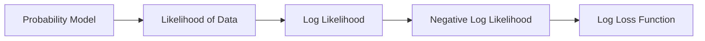

# 🎬 The Story of Logistic Regression

## Step 10: Maximum Likelihood — Why Logistic Regression Uses Log Loss

---

## 🎭 Scene: Riya Notices Something Strange

Back in the classroom…

Riya is staring at the board.

Professor Arjun has written the loss function again.

[
Loss = -[y\log(p) + (1-y)\log(1-p)]
]

Riya tilts her head.

> 👩 **Riya:**
> “Professor… something feels suspicious.”

> “Why THIS formula?”

> “Who decided we should use **logarithms and probabilities**?”

Milo also looks curious.

> 🤖 **Milo:**
> “Yes… why not some other formula?”

Professor Arjun smiles.

He writes two powerful words.

# 🎯 Maximum Likelihood

---

# 🧠 What Does Maximum Likelihood Mean?

Professor Arjun explains slowly.

Imagine you build a model.

The model predicts probabilities.

Example:

```
Student studied 6 hours
↓
Model prediction
↓
Probability of passing = 0.80
```

Now suppose the real result is:

```
Student PASSED
```

Riya nods.

> 👩 “That means the model predicted correctly.”

Professor Arjun continues.

But suppose the model predicted:

```
Probability = 0.05
```

And the student **still passed**.

That would mean:

```
The model believed this outcome was very unlikely
```

So the model was **bad**.

---

# 🧠 Big Idea of Maximum Likelihood

Professor Arjun writes the principle.

> **Maximum Likelihood means choosing model parameters that make the observed data most probable.**

In simple words:

```
We want a model that makes the real data look very likely.
```

---

# 🎲 Coin Toss Analogy

Professor Arjun pulls a coin from his pocket.

He flips it 10 times.

Result:

```
Heads Heads Heads Heads Heads Heads Heads Heads Heads Tails
```

Riya laughs.

> 👩 “That coin looks biased!”

Professor Arjun asks:

> “What probability of heads would explain this data best?”

Possible guesses:

```
p = 0.5
p = 0.7
p = 0.9
```

Which one makes the observed results **most likely**?

Probably:

```
p ≈ 0.9
```

That value **maximizes the likelihood of the data**.

---

# 🤖 Milo's Situation

In logistic regression Milo predicts probabilities.

Example dataset:

| Hours Studied | Passed |
| ------------- | ------ |
| 2             | 0      |
| 3             | 0      |
| 5             | 1      |
| 6             | 1      |

For each example Milo predicts:

```
p = sigmoid(wx + b)
```

These probabilities tell us:

```
How likely each outcome is
```

---

# 📊 Visualizing Likelihood


Professor Arjun explains.

Imagine trying different parameter values.

Each choice of **w and b** produces a different model.

Each model gives a different **likelihood of the data**.

The best model is the one where:

```
Likelihood is maximum
```

---

# 🧠 How Likelihood Is Calculated

Now we calculate probability of the **entire dataset**.

Example:

| Prediction | Actual |
| ---------- | ------ |
| 0.9        | 1      |
| 0.8        | 1      |
| 0.2        | 0      |
| 0.1        | 0      |

The likelihood becomes:

```
0.9 × 0.8 × (1−0.2) × (1−0.1)
```

Why?

Because:

```
P(y=1) = p
P(y=0) = 1 − p
```

So for every example we multiply probabilities.

---

# ⚠ The Big Problem

Riya notices something.

> 👩 “Professor… we are multiplying many tiny numbers.”

Example:

```
0.8 × 0.7 × 0.9 × 0.6 × 0.4 × 0.5
```

After many data points the result becomes:

```
Extremely tiny
```

Hard to compute.

Professor Arjun nods.

---

# 🧠 The Log Trick

Mathematicians use a trick.

Instead of maximizing likelihood:

```
maximize product of probabilities
```

They maximize:

```
log(likelihood)
```

Because logs convert multiplication into addition.

```
log(a × b × c)
=
log(a) + log(b) + log(c)
```

Much easier.

---

# 📉 From Likelihood to Loss

Now we have:

```
maximize log likelihood
```

But machine learning usually **minimizes things**, not maximizes.

So we take **negative log**.

```
minimize − log likelihood
```

And guess what appears?

Exactly the same formula we saw earlier.

[
Loss = -[y\log(p) + (1-y)\log(1-p)]
]

Riya's eyes widen.

> 👩 **Riya:**
> “Wait… that's our **log loss function**!”

Professor Arjun smiles.

> 👨‍🏫 “Exactly.”

---

# 🎯 The Big Connection

Logistic regression is not random.

It comes from **probability theory**.



So when we train logistic regression:

```
Minimizing log loss
=
Maximizing likelihood
```

Meaning:

```
We choose parameters that make the observed data most probable
```

---

# 🤖 Milo Finally Understands

Milo summarizes his learning.

```
1. Predict probability using sigmoid
2. Measure loss using log loss
3. Adjust weights using gradient descent
4. This maximizes likelihood of real data
```

Riya claps.

> 👩 “Wow… logistic regression is actually **statistics + optimization**!”

Professor Arjun nods.

---
