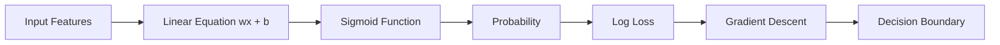
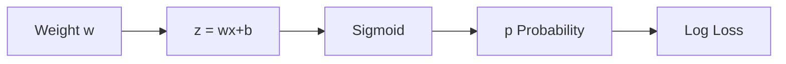
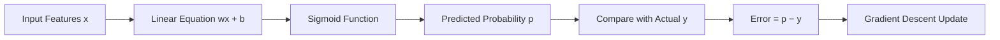

# 🎬 The Story of Logistic Regression

## Step 12: Why the Gradient Becomes **(Prediction − Actual)**

---

## 🎭 Scene: Riya Notices a Strange Shortcut

The class is almost over.

Milo has learned many powerful ideas:



Riya flips through her notebook.

She suddenly looks surprised.

> 👩 **Riya:**
> “Professor… something strange happened.”

She points at the gradient calculation.

> “All the complicated math disappeared!”

Instead of a scary formula, the final gradient looked like this:

```
Gradient = Prediction − Actual
```

Example:

```
Prediction = 0.8
Actual = 1
Gradient = -0.2
```

Riya squints.

> “Why is the gradient **so simple**?”

Milo also looks confused.

> 🤖 “Where did all the **sigmoid and log math** go?”

Professor Arjun smiles.

---

# 🧠 The Big Secret

Professor Arjun writes on the board:

```
Sigmoid + Log Loss = Simple Gradient
```

That beautiful simplification is **one of the reasons logistic regression works so well**.

But to understand it, we must walk slowly.

---

# 🧩 Step 1: What We Are Trying to Optimize

Remember our loss function.

[
Loss = -[y \log(p) + (1-y)\log(1-p)]
]

Where:

| Symbol | Meaning               |
| ------ | --------------------- |
| y      | actual label (0 or 1) |
| p      | predicted probability |

And remember:

```
p = sigmoid(z)
```

where

```
z = wx + b
```

So the pipeline is:

```
x → z → sigmoid → p → loss
```

---

# 🎯 What Gradient Means Here

Gradient simply answers:

> **If I change the weight slightly, how will the loss change?**

Mathematically:

```
d(Loss) / d(weight)
```

That tells Milo how to **adjust the weight**.

---

# 🔗 The Chain Reaction

Professor Arjun draws a dependency chain.



If weight changes:

```
w changes
↓
z changes
↓
sigmoid output changes
↓
probability changes
↓
loss changes
```

This chain is why we use something called **Chain Rule**.

But don't worry about calculus.

We only need the intuition.

---

# 🧠 The Amazing Simplification

When we apply the chain rule step-by-step, something magical happens.

All the complicated pieces cancel out.

What remains is simply:

[
\text{Gradient} = p - y
]

Where:

```
p = predicted probability
y = actual label
```

Riya's eyes widen.

> 👩 “Wait… that’s just **prediction minus reality**!”

Exactly.

---

# 📊 Let's See a Few Examples

### Example 1: Model is Correct

| Prediction | Actual | Gradient |
| ---------- | ------ | -------- |
| 0.95       | 1      | -0.05    |

Meaning:

```
Tiny error → tiny update
```

---

### Example 2: Model is Wrong

| Prediction | Actual | Gradient |
| ---------- | ------ | -------- |
| 0.20       | 1      | -0.80    |

Meaning:

```
Big error → big correction
```

---

### Example 3: Opposite Mistake

| Prediction | Actual | Gradient |
| ---------- | ------ | -------- |
| 0.85       | 0      | 0.85     |

Meaning:

```
Model must decrease probability strongly
```

---

# 📉 Visual Intuition


The difference between **prediction and reality** tells the model **how wrong it is** and **which direction to move**.

---

# 🤖 Milo's Final Learning Rule

Milo summarizes everything in his notebook.

```
Step 1: Predict probability
Step 2: Compare with real label
Step 3: Compute error (p − y)
Step 4: Adjust weights using gradient descent
```

So the weight update becomes:

```
w_new = w_old − learning_rate × (p − y) × x
```

Riya smiles.

> 👩 “So the model is literally learning from its **mistakes**.”

Professor Arjun nods.

---

# 🎯 Why This Is Beautiful

Logistic regression combines:

| Concept             | Role                           |
| ------------------- | ------------------------------ |
| Sigmoid             | Converts scores to probability |
| Log Loss            | Measures prediction error      |
| Maximum Likelihood  | Gives statistical foundation   |
| Gradient Descent    | Optimizes the model            |
| Simplified Gradient | Makes training efficient       |

All these ideas connect together perfectly.

---

# 🤖 Milo's Complete Learning Machine



---

# 🎬 Riya's Final Question

Riya closes her notebook.

> 👩 “Professor… logistic regression seems very powerful.”

She pauses.

Then asks the next natural question.

> **“What happens when we have many features?”**

For example:

```
hours studied
attendance
sleep
practice tests
```

How does logistic regression handle **multiple inputs**?

Professor Arjun smiles.

---

# 🚀 What's Next?

## Step 13: Multiple Logistic Regression

We will explore:

• how logistic regression works with **many features**
• how the **decision boundary becomes a line, plane, or hyperplane**
• how real ML models combine **dozens of variables**

And Milo will learn how to make **much smarter predictions**.
