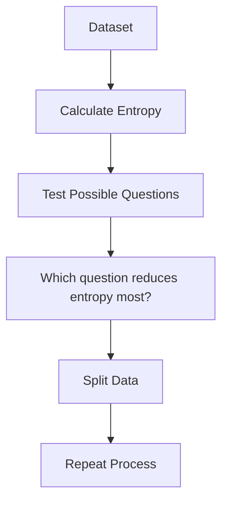

# 🌳 Chapter: How to Calculate Entropy 

### 🎭 Meet Our Characters Again

* 👩 **Riya** — still curious and asking “why?” every 5 minutes
* 👨‍🏫 **Professor Arjun** — calm, patient, and slightly dramatic when teaching
* 🤖 **Milo** — our tiny robot who is learning how to build **Decision Trees**

---

# 🌅 Scene: Milo Faces a Confusing Dataset

One day Milo is trying to decide:

> **“Should we play cricket today?”**

But the data looks messy.

| Weather | Play Cricket? |
| ------- | ------------- |
| Sunny   | No            |
| Sunny   | No            |
| Sunny   | Yes           |
| Rainy   | Yes           |
| Rainy   | Yes           |
| Rainy   | Yes           |

Milo scratches his head.

> 🤖 Milo: “Some yes… some no… how confused is this data?”

Professor Arjun smiles.

> 👨‍🏫 “Good question Milo.
> To measure **confusion**, we use something called **Entropy**.”

---

# 🧠 What is Entropy?


Professor Arjun writes on the board:

> **Entropy = Measure of Disorder / Uncertainty in data**

Think of it like **messiness**.

| Situation         | Entropy   |
| ----------------- | --------- |
| All answers same  | Very Low  |
| Half yes, half no | Very High |

---


# 🍬 A Candy Jar Example (Super Intuitive)

Riya imagines two jars.

### Jar A

🍬🍬🍬🍬🍬
All **chocolate candies**

If you pick one, you are **100% sure** it's chocolate.

**Confusion = 0**

Entropy = **0**

---

### Jar B

🍬🍬🍭🍭🍬🍭
Chocolate and strawberry mixed.

Now when you pick one:

You are **not sure** what you'll get.

Confusion increases.

Entropy becomes **higher**.

---

# 📊 Visual Intuition


Think of entropy like:

```
Ordered data  → Low entropy
Mixed data    → High entropy
```

Decision trees **prefer low entropy**.

---

# 📐 The Entropy Formula

Now Professor Arjun shows the famous formula.


Don't panic. We'll go slowly.

[
Entropy = - \sum p \log_2(p)
]

Which simply means:

```
Entropy = -(p₁ log₂ p₁ + p₂ log₂ p₂ + ...)
```

Where:

* **p** = probability of each class

Example:

* probability of **Yes**
* probability of **No**

---

# 🧮 Step-by-Step Calculation Example

Dataset:

| Result |
| ------ |
| Yes    |
| Yes    |
| Yes    |
| No     |
| No     |

Total samples = **5**

---

## Step 1 — Find Probabilities

Yes = 3
No = 2

So:

```
P(Yes) = 3/5 = 0.6
P(No)  = 2/5 = 0.4
```

---

## Step 2 — Apply Formula

[
Entropy = -(0.6\log_2(0.6) + 0.4\log_2(0.4))
]

---

## Step 3 — Calculate Log Values

Approx values:

```
log₂(0.6) ≈ -0.737
log₂(0.4) ≈ -1.321
```

---

## Step 4 — Multiply

```
0.6 × (-0.737) = -0.442
0.4 × (-1.321) = -0.528
```

---

## Step 5 — Add Them

```
Entropy = -(-0.442 - 0.528)
```

```
Entropy ≈ 0.97
```

---

# 🎯 Final Result

Entropy ≈ **0.97**

This means:

> The data is **quite mixed**.

Not perfectly messy, but **some confusion exists**.

---


# 🧠 Special Entropy Cases

Professor Arjun shows three situations.

---

## Case 1 — Perfectly Pure Data

| Result |
| ------ |
| Yes    |
| Yes    |
| Yes    |

```
P(Yes) = 1
```

Entropy:

```
= -(1 log₂ 1)
= 0
```

✔ **No confusion**

---

## Case 2 — Perfectly Mixed Data

| Result |
| ------ |
| Yes    |
| Yes    |
| No     |
| No     |

```
P(Yes) = 0.5
P(No) = 0.5
```

Entropy:

```
= -(0.5 log₂ 0.5 + 0.5 log₂ 0.5)
= 1
```

🔥 **Maximum confusion**

---

## Case 3 — Slightly Mixed

Example:

```
70% Yes
30% No
```

Entropy ≈ **0.88**

Some confusion, but less than 50-50.

---

# 🤖 Why Milo Cares About Entropy

Milo wants to build a **Decision Tree**.

So Milo keeps asking:

> “Which question reduces confusion the most?”

Example questions:

* Is weather **sunny**?
* Is temperature **high**?

The question that **reduces entropy the most** becomes the **tree split**.

---

# 📊 Decision Tree Logic



---

# 🎬 Final Scene

Milo now understands:

> 🤖 “Entropy tells me **how messy the data is**.”

So the goal is simple:

```
Start with high entropy
Split the data
Create groups with low entropy
```

That’s how a **Decision Tree learns**.

---

# 🧠 What You Just Learned

✔ What entropy means
✔ Why entropy measures **data disorder**
✔ The entropy formula
✔ Step-by-step entropy calculation
✔ Special entropy cases (0, 1, between)

---

# 👀 What’s Next?

Now Riya asks a brilliant question:

> 👩 “Okay… we know entropy.
> But how do we choose the **best split**?”

Professor Arjun smiles.

> 👨‍🏫 “That’s where the hero enters…”

🔥 **Information Gain**

---


